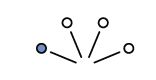
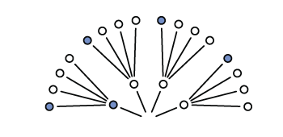
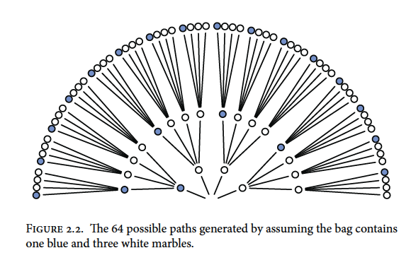
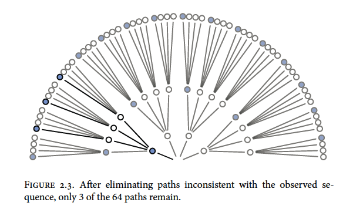
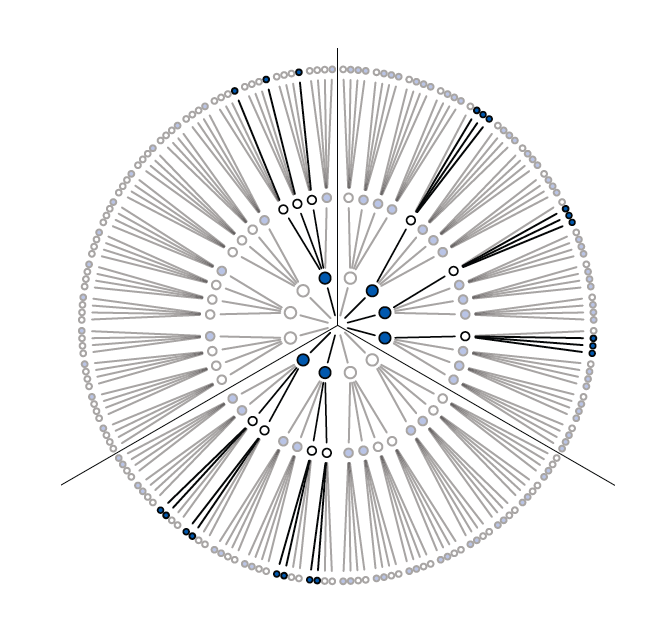
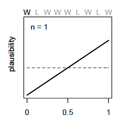
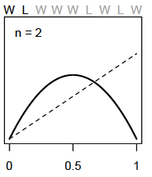
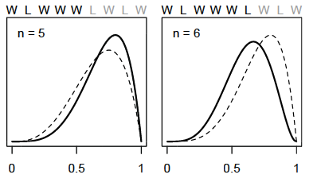
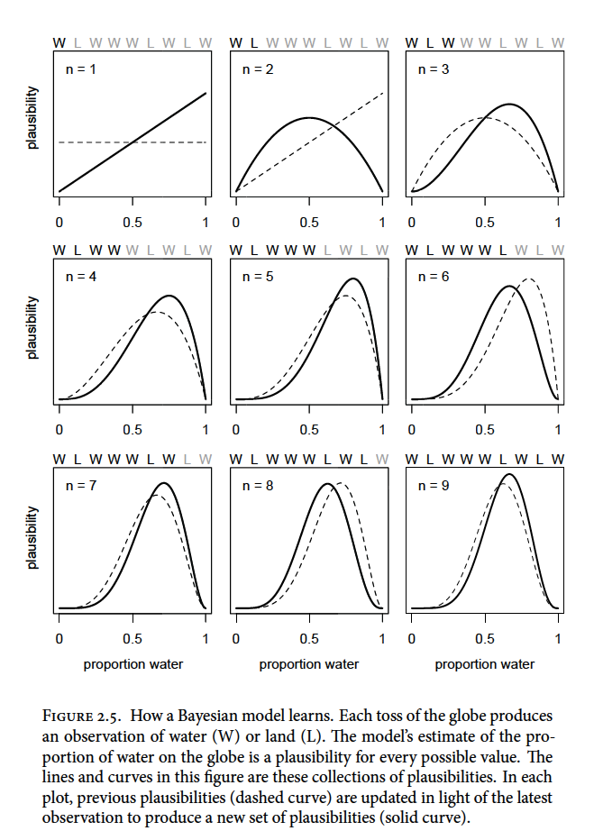

# Small worlds and large worlds

Every model has two parts: small world and large world. *The small world* is within the model itself and *the large world* is the broader world we want the model to be applied to. In the small world, everything is defined and there isn't much room for pure surprises. The large world has more opportunities for unforeseen events and because the small world is an incomplete representation of the large world, mistakes are expected. The goal is to create small worlds (models) that approximate reality so that they perform well in the large world.

## The garden of forking data

Bayesian inference is the counting and comparing of possibilities. At each point where a 'decision' may split the path, bayesian inference evaluates each path and eliminates the paths that are not congruent with the data fed into the model.

### Counting possibilities

**Marble Example**

There is a bag of four marbles of two colours (blue and white). This means that there could be 5 possibilities (conjectures); 4:0 white, 3:1 white, 2:2 split, 3:1 blue, and 4:0 blue. 

A sequence of three marbles is pulled from the bag, one at a time, and returned to the bag (repeated sampling)\
We get blue, white, blue.

Considering a 3:1 white scenario, on the first draw you could get a blue marble or three white marble draws\
```{r echo=FALSE, out.width="300px"}

```

Expanding out one more draw (layer) we can expect the same possibilities because the first marble is replaced before the second draw\
```{r echo=FALSE, out.width="300px"}

```

Expanding one more time gives us the final garden of 64 possibilities (4^3^; 4 marbles with 3 draws)\
```{r echo=FALSE, out.width="300px"}

```

Now recall our draws were blue, white, blue so we can trim the paths that are not congruent with the draws\
```{r echo=FALSE, out.width="300px"}

```

We can also trim other possibilities like all white marbles or all blue marbles because we drew both colours from the bag. Putting our 3:1 white, 2:2 split, and 3:1 blue possibilities together would look something like this\
```{r echo=FALSE, out.width="300px"}

```

You can see that there are different numbers of unique paths to get our observed result\
3:1 white has 3 paths\
2:2 split has 8 paths\
3:1 blue has 9 paths\

We will call these counts our priors.


### Combining other information

Suppose we make another marble draw and it is blue. We then count the ways each of our marble possibilities could create this new result\

3:1 white has 1 path\
2:2 split has 2 paths\
3:1 blue has 3 paths\

Mutiplying by the prior counts gives us:\

3:1 white has (3x1) 3 paths\
2:2 split has (8x2) 16 paths\
3:1 blue has (9x3) 27 paths\

and suggests that our 3:1 blue possibility is more plausible with the new information.\
*Note that prior data and new data don't have to be of the same type*\

If we knew that the marble factory made the bags of marbles at fixed rates (i.e. there are 3x more 3:1 white bags as there are 3:1 blue bags and 2x as many 2:2 split bags than 3:1 blue bags) we could update our prior knowledge\

3:1 white has 3 paths x 3 factory rate = 9\
2:2 split has 16 paths x 2 factory rate = 32\
3:1 blue has  27 paths x 1 factory rate = 27\

Now the 2:2 split bag seems to be the most plausible outcome (by a small margin)

### From counts to probability

To avoid observation counts from getting quickly out of hand (over a million possible sequences after 10 data points) we need to collapse the information in a way that is easy to manipulate with the data.\

Continuing our marble example\
The plausibility of 3:1 white after seeing blue, white, blue is proportional to the ways 3:1 white can produce blue, white, blue * prior plausibility of 3:1 white.\

In other words if $p$ is the proportion of blue marbles then in a 3:1 white bag $p$ = 0.25 (1/4)\
And if we call our data (blue, white, blue) $D~new~$ we can write:\

The plausibility of $p$ after $D~new~$ $\propto$ ways $p$ can produce $D~new~$ $\times$ prior plausibility of $p$\

We then standardize the plausibility of $p$ after $D~new~$ by dividing by the sum of the products to make the sum of plausibility to equal 1\

\begin{equation} 
  \text{The plausibility of } p \text{ after } D~new~ = \frac{\text{ways } p \text{ can produce } D~new~ \times \text{prior plausibility of } p}{\text{sum of products}}
\end{equation}

If you recall our first count of the paths to obtain our observations we had:\
3:1 white has 3 paths\
2:2 split has 8 paths\
3:1 blue has 9 paths\

To illustrate the standardization of plausibility in R:
```{r}
ways <- c(3, 8, 9)
ways/sum(ways)
```

We can now think of these plausibilities as *probabilities* that sum to 1\

New terms:\
_Parameter_ : $p$ or the conjectured proportion of blue marbles. (indexing ways to explain the data)\
_Likelihood_ : The relative number of ways that a parameter value ($p$) can produce the data\
_Prior probability_ : The prior plausibility of any $p$ value\
_Posterior probability_ : The new, updated plausibility of and $p$ value\

## Building a model

**Globe example**

You have a globe and want to know how much surface is covered in water. You throw it in the air multiple times and when you catch it, what lies under your right index finger is recorded. The first nine throws are:\

> W L W W W L W L W

with W meaning water and L meaning land. The ratio of water to land is 6:3 (2:1). This will be our *data*\

Steps to design your model:\

1. Data story: Motivate the model by narrating how the data might arise
2. Update: Educate your model by feeding it data
3. Evaluate: All statistical models require supervision, leading to model revision

### A data story

You can be descriptive in your data story by defining associations that can be used to predict outcomes. Or you can have a causal story where some events produce others. Typically casual stories are also descriptive.

A good place to start is restating the sampling process:\

1. The true proportion of water covering the globe is $p$
2. A single toss of the globe has probability $p$ of producing a water (W) observation. Land probability is $1 - p$
3. Each toss is independent of the others

### Bayesian updating

A Bayesian model must start with one set of plausibilities for each possible scenario or *Prior plausibilities*. The model then updates the plausibilities using the input of the data and creates the *Postierior plausibilties*. For the globe example, the plausibility for each $p$ value is set to be the same.

So before the first draw, the model assumes an equal uniform plausibility for any proportion of water ($p$) shown as the dashed line below. After the first draw (W), the model updates its plausibility of water proportion to have a very unlikely chance that there is almost no water and a high chance there is a lot of water (solid line below) because there is no known land\
```{r echo=FALSE, out.width="200px"}

```

For each additional data point (toss) we see the model adjust its plausibility expectations. After the second toss (L), the model adjusts the plausibility of $p$ to be highest at 0.5 or 1/2 as we have seen a proportion of 0.5 in the data so far\
```{r echo=FALSE, out.width="200px"}

```

As we add observations, W observations will shift the plausibility peak of $p$ to the right and L observations will pull it back to the left\
```{r, echo=FALSE, out.width="300px"}

```

Note that as observations are added, the height of the peak increases as fewer values of $p$ gain plausibility\
```{r, echo=FALSE, out.width="600px"}

```

### Evaluate

To ensure that the model is behaving as it should to be applicable to the large world, it should be always be checked. The model's certainty is not the same as accuracy. As you increase the amount of tosses of the globe the model will become more and more certain of the plausibility of a $p$ value (a narrow and tall curve). This could be an artifact of the model and could look very different under another model. Also, be sure to supervise and critique your model's work as it can't supervise itself. 

## Components of the model

Recall that we have counted a few different things already\

1. The number of ways each conjecture (mix of marbles) could produce an observation
2. The accumulated number of ways each conjecture could produce the entire data
3. The initial plausibility of each conjectured cause of the data

Here are some components related to these things that will help us understand what is happening within the models we build\

### Variables

Variables are the things we want to infer. They can be proportions, rates, even the data itself. In the globe example we had three variables\

1. $p$, the proportion of water, our target of inference
This value was 'unobservable' so it could be labled as a *paramter*\
2. Observed counts of water (W)
3. Observed counts of land (L)

### Definitions
p. 33
We must define our variables and how they relate to each other

