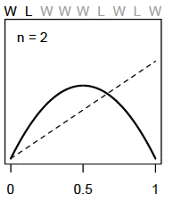

--- 
title: "Rethinking Companion"
author: "Wade VanderWright"
date: "`r Sys.Date()`"
site: bookdown::bookdown_site
documentclass: book
bibliography: [book.bib, packages.bib]
# url: your book url like https://bookdown.org/yihui/bookdown
# cover-image: path to the social sharing image like images/cover.jpg
description: |
  This is a minimal example of using the bookdown package to write a book.
  The HTML output format for this example is bookdown::gitbook,
  set in the _output.yml file.
link-citations: yes
github-repo: rstudio/bookdown-demo
---

# The Golem of Prague

This is a _companion_ book written in Markdown for McElreath's *Statistical Rethinking* (2020). You can set up your R console by running:

```{r eval=FALSE}
install.packages(c("coda","mvtnorm","devtools","dagitty"))
library(devtools)
devtools::install_github("rmcelreath/rethinking")
```

## Statistical golems

The Golem of Prague and statistical golems (models) are powerful but lack wisdom. As McElreath tells us, there are many kinds of golems and figuring out how to build the one you need to carry out the task at hand can be tricky. 

Figure 1.1
```{r echo=FALSE}
knitr::include_graphics("./_images/fig1.1.png")
```


In addition, novel research often requires novel methods and the researchers may have to stray from the common tests to engineer their own golems.


## Statistical Rethinking

>A lot can go wrong with statistical inference, and this is one reason that beginners are
>so anxious about it. When the goal is to choose a pre-made test from a flowchart, then the
>anxiety can mount as one worries about choosing the “correct” test.

More work is needed to ensure researchers understand all the moving parts of their golems and how to interpret their results.

### What are we trying to do with the golems?

The popular belief is that we need to create models that use statistical means to test the null hypothesis. 

Two reasons why deductive falsification doesn't work:

>1. Hypotheses are not models. The relations among hypothese and different kinds of models are complex. Many models correspond to the same hypothesis, and many hypotheses corresponf to asingle model. This makes strict falsification impossible. 

All models are false, but some are useful.

Figure 1.2
```{r echo=FALSE}
knitr::include_graphics("./_images/fig1.2.png")
```

Two opposing hypothesis for evolutionary change:

H~0~: Neutral theory (random mutation and drift) 

H~1~: Natural selection (fitness leads to observed change)

Process models for each hypothesis:

P~0a~: steady state in time (null)

P~0b~: fluctuations in population size through time

P~1a~: selection favours the same alleles through time

P~1b~: selection preference fluctuates through time (different alleles)

Statistical Models:

M~i~: unique to P~0b~

M~ii~: Power law in the data (frequency) shared expectation of *P~0a~ and P~1b~*

M~iii~: unique to P~1a~

*Note that all process models contain time, solidifying directionality*


>2. Measurements matter. Even when we think the data falsify a model, another observer will debate our methods and measures. They don't trust the data. Sometime sthey are right.

_The colour of swans_

Before Australia was discovered, all swans were white and no number of observations could prove this fact to be true.

H~0~: All swans are white

Australia had black swans, which instantly makes H~0~ false.

Remember, observations are prone to error and hypotheses are quantitative rather than discrete. 

>"At the edges of scientific knowledge, the ability to measure a hypothetical phenomenon is often in question as much as the phenomenon itself."


## Tools for golem engineering

>You'll wreck Prague eventually, you just need to notice the destruction.

We want our models to be able to design inquiry, extract information from data, and make predictions. To do this we will need:

1. Bayesian data analysis
2. Model comparison
3. Multilevel Models
4. Graphical causal models

### Bayesian data analysis

Bayesian data analysis takes questions in the form of a model and produces logical probability distributions of the answer. This represents plausibility. 

### Model comparison and predictions

Model comparison is often thought of in terms of 'which model will make the best predictions?' Two tools for this are Cross-validation and Information Criteria. 

Complex models usually make worse predictions than simple ones due to *overfitting*. The smarter the golem, the dumber its predictions. Fitting is easy; prediction is hard.

### Multilevel models

### Graphical causal models


## Summary


## Session Info {-} 

```{r}
sessionInfo()
```


```{r include=FALSE}
# automatically create a bib database for R packages
knitr::write_bib(c(
  .packages(), 'bookdown', 'knitr', 'rmarkdown'
), 'packages.bib')
```

<!--chapter:end:index.Rmd-->

# Small worlds and large worlds

Every model has two parts: small world and large world. *The small world* is within the model itself and *the large world* is the broader world we want the model to be applied to. In the small world, everything is defined and there isn't much room for pure surprises. The large world has more opportunities for unforeseen events and because the small world is an incomplete representation of the large world, mistakes are expected. The goal is to create small worlds (models) that approximate reality so that they perform well in the large world.

## The garden of forking data

Bayesian inference is the counting and comparing of possibilities. At each point where a 'decision' may split the path, bayesian inference evaluates each path and eliminates the paths that are not congruent with the data fed into the model.

### Counting possibilities

**Marble Example**

There is a bag of four marbles of two colours (blue and white). This means that there could be 5 possibilities (conjectures); 4:0 white, 3:1 white, 2:2 split, 3:1 blue, and 4:0 blue. 

A sequence of three marbles is pulled from the bag, one at a time, and returned to the bag (repeated sampling)\
We get blue, white, blue.

Considering a 3:1 white scenario, on the first draw you could get a blue marble or three white marble draws\
```{r echo=FALSE, out.width="300px"}
knitr::include_graphics("./_images/fig2.1.png")
```

Expanding out one more draw (layer) we can expect the same possibilities because the first marble is replaced before the second draw\
```{r echo=FALSE, out.width="300px"}
knitr::include_graphics("./_images/fig2.2.png")
```

Expanding one more time gives us the final garden of 64 possibilities (4^3^; 4 marbles with 3 draws)\
```{r echo=FALSE, out.width="300px"}
knitr::include_graphics("./_images/fig2.3.png")
```

Now recall our draws were blue, white, blue so we can trim the paths that are not congruent with the draws\
```{r echo=FALSE, out.width="300px"}
knitr::include_graphics("./_images/fig2.4.png")
```

We can also trim other possibilities like all white marbles or all blue marbles because we drew both colours from the bag. Putting our 3:1 white, 2:2 split, and 3:1 blue possibilities together would look something like this\
```{r echo=FALSE, out.width="300px"}
knitr::include_graphics("./_images/fig2.5.png")
```

You can see that there are different numbers of unique paths to get our observed result\
3:1 white has 3 paths\
2:2 split has 8 paths\
3:1 blue has 9 paths\

We will call these counts our priors.


### Combining other information

Suppose we make another marble draw and it is blue. We then count the ways each of our marble possibilities could create this new result\

3:1 white has 1 path\
2:2 split has 2 paths\
3:1 blue has 3 paths\

Mutiplying by the prior counts gives us:\

3:1 white has (3x1) 3 paths\
2:2 split has (8x2) 16 paths\
3:1 blue has (9x3) 27 paths\

and suggests that our 3:1 blue possibility is more plausible with the new information.\
*Note that prior data and new data don't have to be of the same type*\

If we knew that the marble factory made the bags of marbles at fixed rates (i.e. there are 3x more 3:1 white bags as there are 3:1 blue bags and 2x as many 2:2 split bags than 3:1 blue bags) we could update our prior knowledge\

3:1 white has 3 paths x 3 factory rate = 9\
2:2 split has 16 paths x 2 factory rate = 32\
3:1 blue has  27 paths x 1 factory rate = 27\

Now the 2:2 split bag seems to be the most plausible outcome (by a small margin)

### From counts to probability

To avoid observation counts from getting quickly out of hand (over a million possible sequences after 10 data points) we need to collapse the information in a way that is easy to manipulate with the data.\

Continuing our marble example\
The plausibility of 3:1 white after seeing blue, white, blue is proportional to the ways 3:1 white can produce blue, white, blue * prior plausibility of 3:1 white.\

In other words if $p$ is the proportion of blue marbles then in a 3:1 white bag $p$ = 0.25 (1/4)\
And if we call our data (blue, white, blue) $D~new~$ we can write:\

The plausibility of $p$ after $D~new~$ $\propto$ ways $p$ can produce $D~new~$ $\times$ prior plausibility of $p$\

We then standardize the plausibility of $p$ after $D~new~$ by dividing by the sum of the products to make the sum of plausibility to equal 1\

\begin{equation} 
  \text{The plausibility of } p \text{ after } D~new~ = \frac{\text{ways } p \text{ can produce } D~new~ \times \text{prior plausibility of } p}{\text{sum of products}}
\end{equation}

If you recall our first count of the paths to obtain our observations we had:\
3:1 white has 3 paths\
2:2 split has 8 paths\
3:1 blue has 9 paths\

To illustrate the standardization of plausibility in R:
```{r}
ways <- c(3, 8, 9)
ways/sum(ways)
```

We can now think of these plausibilities as *probabilities* that sum to 1\

New terms:\
_Parameter_ : $p$ or the conjectured proportion of blue marbles. (indexing ways to explain the data)\
_Likelihood_ : The relative number of ways that a parameter value ($p$) can produce the data\
_Prior probability_ : The prior plausibility of any $p$ value\
_Posterior probability_ : The new, updated plausibility of and $p$ value\

## Building a model

**Globe example**

You have a globe and want to know how much surface is covered in water. You throw it in the air multiple times and when you catch it, what lies under your right index finger is recorded. The first nine throws are:\

> W L W W W L W L W

with W meaning water and L meaning land. The ratio of water to land is 6:3 (2:1). This will be our *data*\

Steps to design your model:\

1. Data story: Motivate the model by narrating how the data might arise
2. Update: Educate your model by feeding it data
3. Evaluate: All statistical models require supervision, leading to model revision

### A data story

You can be descriptive in your data story by defining associations that can be used to predict outcomes. Or you can have a causal story where some events produce others. Typically casual stories are also descriptive.

A good place to start is restating the sampling process:\

1. The true proportion of water covering the globe is $p$
2. A single toss of the globe has probability $p$ of producing a water (W) observation. Land probability is $1 - p$
3. Each toss is independent of the others

### Bayesian updating

A Bayesian model must start with one set of plausibilities for each possible scenario or *Prior plausibilities*. The model then updates the plausibilities using the input of the data and creates the *Postierior plausibilties*. For the globe example, the plausibility for each $p$ value is set to be the same.

So before the first draw, the model assumes an equal uniform plausibility for any proportion of water ($p$) shown as the dashed line below. After the first draw (W), the model updates its plausibility of water proportion to have a very unlikely chance that there is almost no water and a high chance there is a lot of water (solid line below) because there is no known land\
```{r echo=FALSE, out.width="200px"}
knitr::include_graphics('./_images/fig2.6.png')
```

For each additional data point (toss) we see the model adjust its plausibility expectations. After the second toss (L), the model adjusts the plausibility of $p$ to be highest at 0.5 or 1/2 as we have seen a proportion of 0.5 in the data so far\
```{r echo=FALSE, out.width="200px"}

```

As we add observations, W observations will shift the plausibility peak of $p$ to the right and L observations will pull it back to the left\
```{r, echo=FALSE, out.width="300px"}
knitr::include_graphics('./_images/fig2.8.png')
```

Note that as observations are added, the height of the peak increases as fewer values of $p$ gain plausibility\
```{r, echo=FALSE, out.width="600px"}
knitr::include_graphics('./_images/fig2.9.png')
```

### Evaluate

To ensure that the model is behaving as it should to be applicable to the large world, it should be always be checked. The model's certainty is not the same as accuracy. As you increase the amount of tosses of the globe the model will become more and more certain of the plausibility of a $p$ value (a narrow and tall curve). This could be an artifact of the model and could look very different under another model. Also, be sure to supervise and critique your model's work as it can't supervise itself. 

## Components of the model

Recall that we have counted a few different things already\

1. The number of ways each conjecture (mix of marbles) could produce an observation
2. The accumulated number of ways each conjecture could produce the entire data
3. The initial plausibility of each conjectured cause of the data

Here are some components related to these things that will help us understand what is happening within the models we build\

### Variables

Variables are the things we want to infer. They can be proportions, rates, even the data itself. In the globe example we had three variables\

1. $p$, the proportion of water, our target of inference
This value was 'unobservable' so it could be labled as a *paramter*\
2. Observed counts of water (W)\
3. Observed counts of land (L)

### Definitions
We must define our variables and how they relate to each other.\

#### Observed variables
To determine the plausibility of the data to give the target of inference ($p$), we must define a distribution function for each observed variable which we will call a *likelihood*.\

For the globe example we are only concerned with W and L as they are the only events that can occur for each toss. We also need to make assumptions:\

1. Each toss (sample) is independent of the others\
2. The probability of getting W is the same for each sample (allowing re-sampling)\

For instances that are either TRUE or FALSE (0 or 1) we can use something called the *binomial distribution*. (Also called the 'coin tossing' distribution). The probability of observing can be expressed as:\


$\text{Pr}(W, L|p) = \frac{(W + L)! }{W!L!} p^{W}(1 - p)^{L}$\

In words: *The counts of 'water' (W) and 'land' (L) are distributed binomially with probability p of 'water' for each toss.*\

To calculate the likelihood in R you can use the `dbinom` function

```{r, R code 2.2}
dbinom(6, size = 9, prob = 0.5)
```

Recall we had 6 W's from 9 tosses. Here $p$ is held at 0.5 but you can play around with this to see how the likelihood changes.

Hint:
```{r}
plot(dbinom(6, size = 9, prob = seq(from = 0, to = 1, by = 0.1)))
```

#### Unobserved variables
Because we do not observe the $p$ (probability of sampling water) directly, we would define it as a *parameter*. There are other frequent questions that models will try to answer with parameters such as:\
- What is the differece between group A and group B?
- How strong is the association between group and outcome?
- Does the effect of the grouping vary with a covariate?
- How much variation is there among the groups?\

Each parameter of your model must have its own distribution of plausibility that you provide the model before it runs. These are your *priors*. Flat priors are common (as in figure X above) but are hardly representative of real world observations. If you don't have good prior information to help set your prior assumptions of your paramters, then you should try a variety of priors to see how it affects your model's performance.\

### A model is born

Now we can write our model as:\

$W \text{ ~ } \text{Binomial}(N,p)$\

With the prior for $p$ as:\

$p \text{ ~ } \text{Uniform}(0,1)$

So we can say that the amount of water on the globe is a function with the binomial distribution where $N = W + L$ and the probability of water ($p$) is a uniform distribution ranging from 0 to 1. 

## Maiking the model go
read up to PDF page 59 (grid approx)


###grid approx 
```{r, R code 2.3}
#define grid
p_grid <- seq(from = 0, to = 1, length.out = 20)

#define prior
prior <- rep(1,20)

#compute likelihood at each value in the grid
likelihood <- dbinom(6 , size = 9, prob = p_grid)

#compute product of likelihood and prior
unstd.posterior <- likelihood * prior

#standardize posterior so it sums to 1
posterior <- unstd.posterior / sum(unstd.posterior)
```

```{r, R code 2.4}
plot(p_grid, posterior, type = 'b',
     xlab = "probability of water", ylab = "posterior probability")
mtext("20 points")
```

5 points (left side of figure 2.7)
```{r}
#define grid
p_grid <- seq(from = 0, to = 1, length.out = 5)

#define prior
prior <- rep(1,5)

#compute likelihood at each value in the grid
likelihood <- dbinom(6 , size = 9, prob = p_grid)

#compute product of likelihood and prior
unstd.posterior <- likelihood * prior

#standardize posterior so it sums to 1
posterior <- unstd.posterior / sum(unstd.posterior)
```

```{r}
plot(p_grid, posterior, type = 'b',
     xlab = "probability of water", ylab = "posterior probability")
mtext("5 points")
```
100 points
```{r}
#define grid
p_grid <- seq(from = 0, to = 1, length.out = 100)

#define prior
prior <- rep(1,100)

#compute likelihood at each value in the grid
likelihood <- dbinom(6 , size = 9, prob = p_grid)

#compute product of likelihood and prior
unstd.posterior <- likelihood * prior

#standardize posterior so it sums to 1
posterior <- unstd.posterior / sum(unstd.posterior)
```

```{r}
plot(p_grid, posterior, type = 'b',
     xlab = "probability of water", ylab = "posterior probability")
mtext("20 points")
```

1000 points
```{r}
#define grid
p_grid <- seq(from = 0, to = 1, length.out = 1000)

#define prior
prior <- rep(1,1000)

#compute likelihood at each value in the grid
likelihood <- dbinom(6 , size = 9, prob = p_grid)

#compute product of likelihood and prior
unstd.posterior <- likelihood * prior

#standardize posterior so it sums to 1
posterior <- unstd.posterior / sum(unstd.posterior)
```

```{r}
plot(p_grid, posterior, type = 'b',
     xlab = "probability of water", ylab = "posterior probability")
mtext("20 points")
```


Changing priors (recreating fig 2.6)

```{r}
#define grid
p_grid <- seq(from = 0, to = 1, length.out = 20)

#define new priors
prior <- ifelse(p_grid < 0.5, 0, 1)

#compute likelihood at each value in the grid
likelihood <- dbinom(6 , size = 9, prob = p_grid)

#compute product of likelihood and prior
unstd.posterior <- likelihood * prior

#standardize posterior so it sums to 1
posterior <- unstd.posterior / sum(unstd.posterior)
```


```{r}
plot(p_grid, posterior, type = 'b',
     xlab = "probability of water", ylab = "posterior probability")
mtext("20 points")
```


```{r}
#define grid
p_grid <- seq(from = 0, to = 1, length.out = 20)

prior <- exp(-5*abs(p_grid - 0.5))
#compute likelihood at each value in the grid
likelihood <- dbinom(6 , size = 9, prob = p_grid)

#compute product of likelihood and prior
unstd.posterior <- likelihood * prior

#standardize posterior so it sums to 1
posterior <- unstd.posterior / sum(unstd.posterior)
```

```{r}
plot(p_grid, posterior, type = 'b',
     xlab = "probability of water", ylab = "posterior probability")
mtext("20 points")
```

### Quadratic
Nine tosses (n = 9)
```{r, R code 2.6}
library(rethinking)
globe.qa <- quap(
  alist(
        W ~ dbinom(W+L, p) , #binomial likelihood
    p ~ dunif(0,1) #uniform prior
  ) ,
  data = list(W=6, L=3) )

#display the summary of the quadratic approximation
precis(globe.qa)
```
plot analytical vs. the quadratic approximation
```{r, Rcode 2.7}
#analytical calculation
W <- 6
L <- 3
curve( dbeta(x , W+1, L+1), from = 0, to = 1)

#quadratic calculation
curve( dnorm(x, 0.67, 0.16), lty = 2, add = TRUE)
```

compare 9 tosses to 18 and 36 (via Kurs, fig 2.8)
```{r}
library(dplyr)
library(ggplot2)
library(stringr)
n_grid <- 100

tibble(p_grid                  = seq(from = 0, to = 1, length.out = n_grid) %>% rep(., times = 3),
       prior                   = 1,
       w                       = rep(c(6, 12, 24), each = n_grid),
       n                       = rep(c(9, 18, 36), each = n_grid),
       m                       = .67,
       s                       = rep(c(.16, .11, .08), each = n_grid)) %>%
  mutate(likelihood            = dbinom(w, size = n, prob = p_grid)) %>%
  mutate(unstd_grid_posterior  = likelihood * prior,
         unstd_quad_posterior  = dnorm(p_grid, m, s)) %>%
  group_by(w) %>% 
  mutate(grid_posterior        = unstd_grid_posterior / sum(unstd_grid_posterior),
         quad_posterior        = unstd_quad_posterior / sum(unstd_quad_posterior),
         n = str_c("n = ", n)) %>% 
  mutate(n = factor(n, levels = c("n = 9", "n = 18", "n = 36"))) %>% 
  
  ggplot(aes(x = p_grid)) +
  geom_line(aes(y = grid_posterior), color = "blue") +
  geom_line(aes(y = quad_posterior),
            color = "black") +
  labs(x = "proportion water",
       y = "density") +
  theme(panel.grid = element_blank()) +
  facet_wrap(~n, scales = "free")
```


### MCMC
```{r, Rcode 2.8}
n_samples <- 1000
p <- rep(NA, n_samples)
p[1] <- 0.5
W <- 6
L <- 3
for(i in 2:n_samples){
  p_new <- rnorm(1, p[i-1], 0.1)
  if(p_new < 0) p_new <- abs(p_new)
  if(p_new > 1) p_new <- 2 - p_new
  q0 <- dbinom(W, W+L, p[i-1])
  q1 <- dbinom(W, W+L, p_new)
  p[i] <- ifelse(runif(1) < q1/q0, p_new, p[i-1])
}
```

```{r, Rcode 2.9}
#dens(p, xlim=c(0,1))
d <- density(p)
plot(d)
curve(dbeta(x, W+1, L+1), lty = 2, add = TRUE) #quadratic
```
```{r, brms example}
library(brms)

globe_qa_brms <-
  brm(data = list(w = 24), 
      family = binomial(link = "identity"),
      w | trials(36) ~ 1,
      prior(beta(1, 1), class = Intercept),
      iter = 4000, warmup = 1000,
      control = list(adapt_delta = .9),
      seed = 4)
```

```{r}
print(globe_qa_brms)
```

```{r}
posterior_samples(globe_qa_brms) %>% 
  mutate(n = "n = 36") %>%

  ggplot(aes(x = b_Intercept)) +
  geom_density(fill = "black") +
  labs(x = "proportion water") +
  xlim(0, 1) +
  theme(panel.grid = element_blank()) +
  facet_wrap(~n)
```
## Select practice questions

*2M1.* Compute and plot grid approximations for the following:

1. W, W, W
```{r}
#define grid
p_grid <- seq(from = 0, to = 1, length.out = 20)

#define prior
prior <- rep(1,20)

#compute likelihood at each value in the grid
likelihood <- dbinom(3 , size = 3, prob = p_grid)

#compute product of likelihood and prior
unstd.posterior <- likelihood * prior

#standardize posterior so it sums to 1
posterior <- unstd.posterior / sum(unstd.posterior)
```

```{r}
plot(p_grid, posterior, type = 'b',
     xlab = "probability of water", ylab = "posterior probability")
mtext("20 points")
```
2. W, W, W, L
```{r}
#define grid
p_grid <- seq(from = 0, to = 1, length.out = 20)

#define prior
prior <- rep(1,20)

#compute likelihood at each value in the grid
likelihood <- dbinom(3 , size = 4, prob = p_grid)

#compute product of likelihood and prior
unstd.posterior <- likelihood * prior

#standardize posterior so it sums to 1
posterior <- unstd.posterior / sum(unstd.posterior)
```

```{r}
plot(p_grid, posterior, type = 'b',
     xlab = "probability of water", ylab = "posterior probability")
mtext("20 points")
```

3. L, W, W, L, W, W, W
```{r}

#define grid
p_grid <- seq(from = 0, to = 1, length.out = 20)

#define prior
prior <- rep(1,20)

#compute likelihood at each value in the grid
likelihood <- dbinom(5 , size = 7, prob = p_grid)

#compute product of likelihood and prior
unstd.posterior <- likelihood * prior

#standardize posterior so it sums to 1
posterior <- unstd.posterior / sum(unstd.posterior)
```

```{r}
plot(p_grid, posterior, type = 'b',
     xlab = "probability of water", ylab = "posterior probability")
mtext("20 points")
```


*2M2.* Compute the above again but with priors that change from 0 when p<0.5 to a constant when p>0.5.


1. W, W, W
```{r}
#define grid
p_grid <- seq(from = 0, to = 1, length.out = 20)

#define prior
prior <- ifelse(p_grid < 0.5, 0, 3)

#compute likelihood at each value in the grid
likelihood <- dbinom(3 , size = 3, prob = p_grid)

#compute product of likelihood and prior
unstd.posterior <- likelihood * prior

#standardize posterior so it sums to 1
posterior <- unstd.posterior / sum(unstd.posterior)
```

```{r}
plot(p_grid, posterior, type = 'b',
     xlab = "probability of water", ylab = "posterior probability")
mtext("20 points")
```
2. W, W, W, L
```{r}
#define grid
p_grid <- seq(from = 0, to = 1, length.out = 20)

#define prior
prior <- ifelse(p_grid < 0.5, 0, 3)
#compute likelihood at each value in the grid
likelihood <- dbinom(3 , size = 4, prob = p_grid)

#compute product of likelihood and prior
unstd.posterior <- likelihood * prior

#standardize posterior so it sums to 1
posterior <- unstd.posterior / sum(unstd.posterior)
```

```{r}
plot(p_grid, posterior, type = 'b',
     xlab = "probability of water", ylab = "posterior probability")
mtext("20 points")
```

3. L, W, W, L, W, W, W
```{r}

#define grid
p_grid <- seq(from = 0, to = 1, length.out = 20)

#define prior
prior <- ifelse(p_grid < 0.5, 0, 3)
#compute likelihood at each value in the grid
likelihood <- dbinom(5 , size = 7, prob = p_grid)

#compute product of likelihood and prior
unstd.posterior <- likelihood * prior

#standardize posterior so it sums to 1
posterior <- unstd.posterior / sum(unstd.posterior)
```

```{r}
plot(p_grid, posterior, type = 'b',
     xlab = "probability of water", ylab = "posterior probability")
mtext("20 points")
```


*2M4.* Three cards have two sides that can be  black or white. one card is B/B, one is B/W, and one is W/W. They are placed in a bag and shuffled with one drawn and placed on the table black side up. Show the probability of the other side of the card being black.

```{r}
# p = probability of black (initial 6 sides; 3W, 3B; p = 0.5)

# W/W = 0 paths to observed black; p = 0
# B/W = 1 paths to observed black; p = 1/2
# B/B = 1 paths to observed black; p = 1


# W/W = 0 x 0 = 0
# B/W = 1 x 1/2 = 1/2
# B/B = 1 x 1 = 1

ways <- c(0 ,0.5, 1)
ways/sum(ways)
```

*2M5.* A fourth card is added to the example above and it is B/B. Calculate the new probability of the other side of the drawn card being black.
```{r}
# p = 5/8 (eight card sides, 3 W, 5 B)

# W/W = 0 paths to observed black; p = 0
# B/W = 1 path to observed black; p = 1/2
# B/B = 1 path to observed black; p = 1
# B/B = 1 path to observed black; p = 1


# W/W = 0 x 0 = 0
# B/W = 1 x 1/2 = 1/2
# B/B = 1 x 1 = 1
# B/B = 1 x 1 = 1 ; add two black cards together (2)

ways <- c(0 ,0.5, 2)
ways/sum(ways)
```


<!--chapter:end:01-intro.Rmd-->

# Sampling the imaginary

### Probabilities vs. Frequency counts

*Vampires in the population*
_Probabilities_
There is a blood test that can correctly identify a vampire 95% of the time. Or mathematically, Pr(positive|vampire) = 0.95. 1% of the time the test gives a false positive or Pr(positive|mortal) = 0.01. Also, vampires are rare in the population only making up 0.1% of the population so, Pr(vampire) = 0.001\
If someone tests poisitve, what is the probability that they are actually a vampire?\

Using Bayes' theorem, Pr(vampire|positive) can be inverted as:

\begin{equation} 
  \text{Pr(vampire|positive)} = \frac{\text{Pr(positive|vampire)} \times \text{Pr(vampire)} {\text{Pr(positive)}}
\end{equation}

Here, Pr(positive) is the average probability of a positive test result or:

\begin{eqaution}
 \text{Pr(positive)} = \text{Pr(positive|vampire)} \times \text{Pr(vampire)} + \text{Pr(positive|mortal)} \times (1 - \text{Pr(vampire)})
 \end{equation}


```{r, Rcode 3.1}
Pr_Positive_Vampire <- 0.95
Pr_Positive_Mortal <- 0.01
Pr_Vampire <- 0.001

Pr_Positive <- Pr_Positive_Vampire * Pr_Vampire + Pr_Positive_Mortal * (1 - Pr_Vampire)

(Pr_Vampire_Positive <- Pr_Positive_Vampire * Pr_Vampire / Pr_Positive)
```
There is an 8.7% chance that a positive test result is actually a vampire.\

_Frequency counts_

1. In 100,000 people, 100 are vampires
2. of the 100 vampires, 95 will test positive
3. of the 99,900 mortals, 999 will test positive

```{r}
Pr_Positive_Vampire <- 95 / 100
Pr_Positive_Mortal <- 999 / 99900
Pr_Vampire <- 100 / 100000

Pr_Positive <- 95 + 999

(Pr_Vampire_Positive <- Pr_Positive_Vampire * 100 / Pr_Positive)
```
OR:

```{r}
Pr_Positive_Vampire <- 95 #positive results from vampires
Pr_Positive <- 95 + 999 #all positive results

(Pr_Vampire_Positive <- Pr_Positive_Vampire / Pr_Positive)
```


## Sampling from a grid-approximate posterior

Let's recreate the grid approximation for the globe tossing example:
```{r, Rcode 3.2}
p_grid <- seq(from = 0, to = 1, length.out = 1000) #create 1000 values between 0 and 1
prob_p <- rep(1, 1000) #the uniform prior of 1
prob_data <- dbinom(6, size = 9, prob = p_grid) #The observed tosses (data)
posterior <-prob_data*prob_p #calculate the posterior
posterior <-posterior/sum(posterior) #standardize by dividing by the sum
```

Let's pull some samples from our posterior (n = 10000)
```{r, Rcode 3.3}
samples <- sample(p_grid, prob = posterior, size = 1e4, replace = TRUE) #notice replace set to true as there are only 1000 values in p_grid

#find the mode of your samples
getmode <- function(x) {
   uniqv <- unique(x)
   uniqv[which.max(tabulate(match(x, uniqv)))]
}
samples_mode <- getmode(samples)
```

And plot them
```{r, Rcode 3.4}
plot(samples) #left panel of figure 3.1
abline(h = samples_mode, col = 'red')
```

View the samples as a density
```{r, Rcode 3.5}

plot(density(samples), main = "Density of samples from posterior")
polygon(density(samples), col = 'black', border = 'blue')
abline(v = samples_mode, col = 'red')
#library(rethinking)
#dens(samples)
```

## Sampling to summarize

Common questions about your posterior:
1. intervals of _defined boundaries_
2. intervals of _defined probability mass_
3. _point estimates_

### Intervals of defined boundaries

What is the posterior probability that the proportion of water is >0.5?
```{r, Rcode 3.6}
sum(posterior[p_grid < 0.5])
```
about 17%

Doing the same using the samples from the posterior
```{r, Rcode 3.7}
sum(samples < 0.5) / 1e4 #divide by the number of samples you gathered
```
what about between 0.5 and 0.75?
```{r, Rcode 3.8}
sum(samples > 0.5 & samples < 0.75) / 1e4
```
Recreating figure 3.2 (upper left panel)
```{r}
library(ggplot2)
library(dplyr)

df <- tibble(p_grid, posterior)

df %>% ggplot(aes(x = p_grid)) +
  geom_line(aes(y = posterior)) +
  geom_ribbon(data = df %>% filter(p_grid < 0.5),
              aes(ymin = 0, ymax = posterior)) +
  labs(x = "proportion of water (p)",
       y = "density") +
  theme_bw()

```
upper right panel
```{r}

df %>% ggplot(aes(x = p_grid)) +
  geom_line(aes(y = posterior)) +
  geom_ribbon(data = df %>% filter(p_grid < 0.75 & p_grid > 0.5),
              aes(ymin = 0, ymax = posterior)) +
  labs(x = "proportion of water (p)",
       y = "density") +
  theme_bw()
```


### intervals of defined mass

finding the lower 80% of the probability mass using samples
```{r, Rcode 3.9}
(q_80 <- quantile(samples, 0.8))
```

finding the middle 80% (10-90%)
```{r, Rcode 3.10}
(q_10_90 <- quantile(samples, c(0.1, 0.9)))
```


Bottom panels to figure 3.2
lower left:
```{r}
df %>% ggplot(aes(x = p_grid)) +
  geom_line(aes(y = posterior)) +
  geom_ribbon(data = df %>% filter(p_grid < q_80),
              aes(ymin = 0, ymax = posterior)) +
  annotate(geom = 'text', x = 0.25, y = 0.0025,
           label = 'lower 80%') +
  labs(x = "proportion of water (p)",
       y = "density") +
  theme_bw()
```

```{r}
df %>% ggplot(aes(x = p_grid)) +
  geom_line(aes(y = posterior)) +
  geom_ribbon(data = df %>% filter(p_grid > q_10_90[1] & p_grid < q_10_90[2]),
              aes(ymin = 0, ymax = posterior)) +
  annotate(geom = 'text', x = 0.25, y = 0.0025,
           label = 'middle 80%') +
  labs(x = "proportion of water (p)",
       y = "density") +
  theme_bw()
```


example of three tosses and three water observations:
```{r, Rcode 3.11}
p_grid <- seq(from = 0, to = 1, length.out = 1000)
prior <- rep(1, 1000)
likelihood <- dbinom(3, size = 3, prob = p_grid)
posterior <- likelihood * prior
posterior <- posterior / sum(posterior)
samples <- sample(p_grid, size = 1e4, replace = TRUE, prob = posterior)
```

Getting the 50% interval
```{r, Rcode 3.12}
quantile(samples, c(0.25, 0.75))

#PI(samples, prob = 0.5) #rethinking package
```

Tidybayes package:
```{r}
library(tidybayes)

median_qi(samples, .width = 0.5)
```

Notice that all methods above give us the same interval from ~70 - ~93
With tidybayes, you can also look for multiple intervals at once:
```{r}
median_qi(samples, .width = c(0.5, 0.8, 0.99))
```


Finding the *Highest Posterior Density Interval* (HPDI)
```{r, Rcode 3.13}
#HPDI(samples, prob = 0.5) #rethinking
```

```{r}
mode_hdi(samples, .width = 0.5) #tidybayes
```
**Note: you can get just the points of refernce by using qi() for quantiles and hdi() for highest density intervals. Useful for plotting**

recreate figure 3.3
left panel
```{r}
df <- tibble(p_grid, posterior)

df %>% 
  ggplot(aes(x = p_grid)) +
  geom_ribbon(data = df %>% filter(p_grid > qi(samples, .width = 0.5)[1] & 
                                     p_grid < qi(samples, .width = 0.5)[2]),
              aes(ymin = 0, ymax = posterior)) +
  geom_line(aes(y = posterior)) +
  labs(subtitle = '50% Percentile interval',
       x = 'proportion of water (p)',
       y = 'density')+
  theme_bw()
```
right panel
```{r}
df %>% 
  ggplot(aes(x = p_grid)) +
  geom_ribbon(data = df %>% filter(p_grid > hdi(samples, .width = 0.5)[1] & 
                                     p_grid < hdi(samples, .width = 0.5)[2]),
              aes(ymin = 0, ymax = posterior)) +
  geom_line(aes(y = posterior)) +
  labs(subtitle = '50% HPDI',
       x = 'proportion of water (p)',
       y = 'density')+
  theme_bw()
```

### Point estimates

How to get a single useful (?) point estimate for your parameter. First option is the _maximum a posteriori_ (MAP).

```{r, Rcode 3.14}
p_grid[which.max(posterior)] 
```
With samples:
```{r, Rcode 3.15}
Mode(samples) #tidybayes

#chainmode(samples, adj = 0.01) #rethinking
```

what about mean or median?
```{r, Rcode 3.16}
mean(samples)

median(samples)
```

Visualize the mean, median, and mode (figure 3.4)

1. create a small data frame
```{r}
(
point_estimates <- 
  bind_rows(
    mean_qi(samples),
    median_qi(samples),
    mode_qi(samples)
  ) %>% 
  select(y, .point) %>% 
  mutate(x = y + c(-0.03, 0.03, -0.03),
         z = c(0.001, 0.0015, 0.0025))
)
```

2. plot
```{r}
df %>% 
  ggplot(aes(x = p_grid)) +
  geom_ribbon(aes(ymin = 0, ymax = posterior),
              fill = "grey75") +
  geom_vline(xintercept = point_estimates$y) +
  geom_text(data = point_estimates, 
            aes(x = x, y = z, label = .point),
            angle = 90) +
  labs(x = "proportion of water (p)",
       y = "density") +
  theme(panel.grid = element_blank())
```


How do we choose between the point estimates? _Loss functions_

If we assume that p = 0.5 then the expected loss would be:
```{r, Rcode 3.17}
sum(posterior * abs(0.5 - p_grid))
```

applying this method to all values of p_grid:
```{r, Rcode 3.18}
loss <- sapply(p_grid, function(d) sum(posterior * abs(d - p_grid)))
```

Now find the p value with the lowest loss
```{r, Rcode 3.19}

p_grid[which.min(loss)]
```

Visualize the loss function
```{r}
min_loss_x <- p_grid[which.min(loss)]
min_loss_y <- loss[which.min(loss)]

df <- tibble(p_grid, loss)

df %>% 
  ggplot(aes(x = p_grid)) +
  geom_ribbon(aes(ymin = 0, ymax = loss), fill = 'grey75') +
  geom_point(aes(x = min_loss_x, y = min_loss_y), size = 3, shape = 21, color = 'blue') +
  labs(x = 'decision',
       y = 'expected proportional loss') +
  theme(panel.grid = element_blank())
```

## Sampling to simulate prediction

McElreath's 5 reasons for posterior simulation:
1. Model design - We can sample from both the posterior and the priors to see how the model behaves\
2. Model checking - simulating implied observations to check the model fit\
3. Software validation - To double check that the software is running as expected, it helps to simulate observations for a known model and try to recover the parameter values\
4. Research design - you can test observations from your hypothesis to test your design. similar to power analysis\
5. Forecasting - Estimates can be used to simulate new predictions, for new cases and future observations

### Dummy data
From the globe tossing example we can use the likelihood function to create dummy data

\begin{equation}
\text{Pr}(W|N,p) = \frac{N!}{ W!(N-W)!}p^W\left(1-p\right)^{N-W}
\end{equation}

If we had two tosses (N = 2), there are 3 possibilities: 0 W, 1W, 2W. So we can compute the probabilities of each with the p value set to 0.7
```{r, Rcode 3.20}
dbinom(0:2, size = 2, prob = 0.7)
```
So we see a 9% chance for 0 W, 42% chance of 1 W, and 49% 2 W. So we can sample from the binomial distribution. For example:
```{r, Rcode 3.21}
rbinom(1 , size = 2, prob = 0.7)
```
This is a single random draw from the described distribution. You can also sample multiples:
```{r, Rcode 3.22}
rbinom(10, size = 2, prob = 0.7)
```

So we can create a large selection of random draws as dummy data and see if the 0s, 1s, and 2s appear in the same proportions as the probabilities above (9%, 42%, and 49%)
```{r, Rcode 3.23}
dummy_w <- rbinom(1e5, size = 2, prob = 0.7)
table(dummy_w) / 1e5
```
Now, let's update the tosses to match all the previous examples (N = 9).
```{r, Rcode 3.24}
dummy_w <- rbinom(1e5, size = 9, prob = 0.7)
n <- c(1:1e5)
df_w <- tibble(n, dummy_w) 

df_w %>% ggplot(aes(x = dummy_w)) +
  geom_histogram(binwidth = 1) +
  scale_x_continuous("dummy water count", breaks = seq(from = 0, to = 9, by = 2)) +
  ylab("frequency") +
  theme(panel.grid = element_blank())

#simplehist(dummy_w, xlab = 'dummy water count') #rethinking
```

### Model checking

#### Did the software work? 
There actually is no way to check if the software is working correctly. You just have to set yourself an acceptable amount of correspondence between the observations (data) and implied predictions.

#### Is the model adequate? 

We need to incorporate the model's posterior distribution (and its uncertainty) with the implied predictions (and their uncertainty) to create a _Posterior Predictive Distribution_. To visulize this, we can recreate McElreath's figure 3.6 below.

```{r}
# number of grid point in p_grid
n <- 1001
# number of W in 9 tosses
n_w <- 6
# number of tosses
n_t <- 9

# make a table that contains the p_grid, prior, and posterior
df <- tibble(
  p_grid = seq(from = 0, to = 1, length.out = n),
  #prior is still flat
  prior = 1) %>% 
  mutate(likelihood = dbinom(n_w, size = n_t, prob = p_grid)) %>% 
  mutate(posterior = (likelihood * prior)/sum(likelihood*prior))

#visualize the posterior distribution with 9 p values to sample from
df %>% 
  ggplot(aes(x = p_grid)) +
  geom_ribbon(aes(ymin = 0, ymax = posterior),
              color = 'grey70', fill = 'grey70') +
  geom_segment(data = . %>% 
                 filter(p_grid %in% c(seq(from = 0.1, to = 0.9, by = 0.1), 3 / 10)),
               aes(xend = p_grid, y = 0, yend = posterior, size = posterior),
               color = 'grey35', show.legend = FALSE) +
  geom_point(data = . %>% 
               filter(p_grid %in% c(seq(from = 0.1, to = 0.9, by = 0.1), 3 / 10)),
             aes(y = posterior)) +
  annotate(geom = 'text', x = 0.08, y = 0.0025, label = 'Posterior probability') +
  scale_size_continuous(range = c(0,1)) +
  scale_x_continuous('probability of water', breaks = c(0:10) / 10) +
  scale_y_continuous(NULL, breaks = NULL) +
  theme(panel.grid = element_blank())
```

```{r}
#show the sampling distributions for each p value above
library(tidyr)
#number of simulated draws
n_draws <- 1e5

#simulation function
simulate_binom <- function(probability){
  set.seed(11) #reproducible
  rbinom(n_draws, size = 9, prob = probability)
}

# make a table of simulated draws for each probability
df_small <- 
  tibble(probability = seq(from = 0.1, to = 0.9, by = 0.1)) %>% 
  mutate(draws = purrr::map(probability, simulate_binom)) %>% 
  unnest(draws) %>% 
  mutate(label = str_c("p = ", probability))

#create a histogram for each simulated p value
df_small %>% 
  ggplot(aes(x = draws)) +
  geom_histogram(binwidth = 1, center = 0, color = 'grey90', size = 1/10) +
  scale_x_continuous(NULL, breaks = seq(from = 0, to = 9, by = 3)) +
  scale_y_continuous(NULL, breaks = NULL) +
  labs(subtitle = 'Sampling distributions') +
  #coord_cartesian(xlim = 0:9) +
  theme(panel.grid = element_blank()) +
  facet_wrap(~ label, ncol = 9)
```

```{r}
#show the newly calculated PPD

#number of samples
n_samples <- 1e4

#make sure it can be replicated
set.seed(11)
# sample rows of the original dataframe and calculate a W value for each p_grid value
samples <- df %>% 
  sample_n(size = n_samples, weight = posterior, replace = TRUE) %>% 
  mutate(w = purrr::map_dbl(p_grid, rbinom, n = 1, size = 9))

#plot the newly created PPD
samples %>% 
  ggplot(aes(x = w)) +
  geom_histogram(binwidth = 1, center = 0, color = 'grey90', size = 1/10) +
  scale_x_continuous('number of water samples', breaks = seq(from = 0, to = 9, by = 3)) +
  scale_y_continuous(NULL, breaks = NULL) +
  ggtitle('Posterior predictive distribution') +
  #coord_cartesian(xlim = 0:9, ylim = 0:3000) +
  theme(panel.grid = element_blank())
```

The advantage here is that the predictive distribution is still quite spread out compared to the observed data (w = 6). This is much more informative than if we were to just pick out the mode of the posterior and make implied predictions from that value. This would look like the sampling distribution of p = 0.6 above which would be overconfident.

### Practice with brms

Let's create a PPD with brms

Load the package
```{r}
library(brms)
```

```{r}
brms_3 <- brm(data = list(w = 6),
              family = binomial(link = 'identity'),
              w | trials(9) ~ 1,
              prior(beta(1, 1), class = Intercept),
              seed = 11,
              control = list(adapt_delta = 0.999))
```

Posterior summary of the probability of w
```{r}
posterior_summary(brms_3)['b_Intercept', ] %>% 
  round(digits = 2)
```

Now we can sample draws with ```fitted()``` in the brms package from the posterior
```{r}
library(purrr)
f <- fitted(brms_3, summary = FALSE, scale = 'linear') %>% 
  as_tibble() %>% 
  set_names('p')

glimpse(f)
```

As a density:
```{r}
f %>% 
  ggplot(aes(x = p)) +
  geom_density(fill = 'grey50', color = 'grey50') +
  annotate(geom = 'text', x = 0.08, y = 2.5, label = 'Posterior probability') +
  scale_x_continuous('probability of water', breaks = c(0, 0.5, 1), limits = 0:1) +
  scale_y_continuous(NULL, breaks = NULL) +
  theme(panel.grid = element_blank())
```
Now we can use this distribution to simulate samples 
```{r}
#make reproducible
set.seed(11)

#simulate samples
f <- f %>% 
  mutate(w = rbinom(n(), size = n_t, prob = p))

#plot PPD
f %>% 
  ggplot(aes(x = w)) +
  geom_histogram(binwidth = 1, center = 0, color = 'grey90',
                 size = 1/10) +
  scale_x_continuous('number of water samples', breaks = seq(from = 0, to = 9, by =3)) +
  scale_y_continuous(NULL, breaks = NULL, limits = c(0, 1200)) +
  ggtitle('Posterior predictive distribution') +
  theme(panel.grid = element_blank())
```


<!--chapter:end:02-cross-refs.Rmd-->

# Geocentric models

>This chapter introduces linear regression as a Bayesian procedure. Under a probability interpretation, which is necessary for Bayesian work, linear regression uses a Gaussian (normal) distribution to describe our golem’s uncertainty about some measurement of interest. This type of model is simple, flexible, and commonplace. Like all statistical models, it is not universally useful. But linear regression has a strong claim to being foundational, in the sense that once you learn to build and interpret linear regression models, you can more easily move on to other types of regression which are less normal.
>>p. 71

## Why normal distributions are normal
Imagine there are 1000 people standing on the center line of a soccer field and they each have a coin. They each toss their coin 16 times and with each toss, heads means one step left, and tails means one step right. After everyone has done their 16 tosses, can you imagine the distribution of where they would be on the field? It would be roughly normal centered on the center of the field.

### Normal by addition
To simulate this in R we can assign random values that are either left (-1) or right (1) for each coin toss and then add them together.
```{r, Rcode 4.1}
pos <- replicate(1000, sum(runif(16,-1,1)))

plot(density(pos))
```
Now lets visualize what each person's walk
```{r}
#load packages
library(dplyr)
library(tidyr)
library(ggplot2)
#set seed for reproducible plots
set.seed(11)
#create dataframe
pos_df <- replicate(100, runif(16, -1, 1)) %>% #simulation (turned down to 100 people)
  as_tibble() %>% # make it a tibble
  rbind(0, .) %>% # add a row of zeros above the coin tosses as a starting point
  mutate(step = 0:16) %>% #this is the step index
  gather(key, value, -step) %>% #this will convert the data into long format
  mutate(person = rep(1:100, each = 17)) %>%  #this adds a person index (17 times for the 0 and 16 coins)
  group_by(person) %>% #for each person value
  mutate(position = cumsum(value)) %>% #create a cumulative sum for each person
  ungroup()

#create plot
pos_df %>% 
  ggplot(aes(x = step, y = position, group = person)) +
  geom_vline(xintercept = c(4, 8, 16), linetype = 2) +
  geom_line(aes(color = person < 2, alpha = person < 2)) +
  scale_color_manual(values = c('skyblue4','black')) +
  scale_alpha_manual(values = c(1/5, 1)) + 
  scale_x_continuous('step number', breaks = c(0, 4, 8, 12, 16)) +
  theme(legend.position = 'none',
        panel.grid = element_blank())
```

You can see that the more steps you add, the more normal the distribution becomes. 

### Normal by multiplication

Suppose that an organism's growth rate is influenced by 12 loci each with several alleles that code for more growth and that these loci can interact with each other causing multiplicative effects
```{r, Rcode 4.2}
set.seed(11)
prod(1 + runif(12, 0, 0.1))
```
Or more explicitly:
```{r}
set.seed(11)
a = 1
b = runif(12, 0, 0.1)
c = a + b
prod(c)
```
as a density:
```{r, Rcode 4.3}
set.seed(11)
growth <- replicate(10000, prod(1 + runif(12, 0, 0.1)))
plot(density(growth))
```

Now see how the distribution behaves if you change the effect size of the loci
```{r}
set.seed(11)
big <- replicate(10000, prod(1 + runif(12, 0, 0.5)))
plot(density(big))
```
```{r}
set.seed(11)
small <- replicate(10000, prod(1 + runif(12, 0, 0.01)))
plot(density(small))
```

### Normal by log-multiplication

See how skewed the ```big``` distribution was above? If we log transform the product, what do you think we will see?
```{r, Rcode 4.5}
set.seed(11)
log_big <- replicate(10000, log(prod(1 + runif(12, 0, 0.5))))
plot(density(log_big))
```

### Using Gaussian distributions

define ontological


define epistemological


## A language for describing models

Learning the language
1. Recognize the variables you are working with. Observable variables are _data_ and unobservable variables are parameters\
2. Define the variable in terms of the other variables or as probability distributions\
3. The combination of variables and probability distributions are _joint generative models_ that can be used to simulate hypothetical observations as well as analyze real ones\

Summarize the model in a mathy way:\

\begin{equation}
    y_{i} ~ \text{Normal}(\mu_{i}, \sigma)\
    \mu_{i} ~ \beta x_{i}\
    \beta ~ \text{Normal}(0, 10)\
    \sigma ~ \text{Exponential}(1)\
    x_{i} ~ \text{Normal}(0,1)\
\end{equation}

### Re-describing the globe tossing model. 

Recall that the globe tossing model had the variables defined as:\

\begin{equation}
W ~ \text{Binomial}(N, p)\
p ~ \text{Uniform}(0, 1)
\end{equation}

These definitions have implied meanings. For example, the Binomial distribution of $W$ implies that each toss ($N$) is independent of the others. The first line of these simple models are the likelihood function from Bayes' theorem. The other lines will outline priors for variables if defined.

## Gaussian model of height

In this section we will build the beginnings of a regression model that will follow a gaussian distribution with a mean $\mu$ and standard deviation $\sigma$. The model will take in data or a predictor variable and evaluate all possible values of $\mu$ and $\sigma$ to produce a distribution of distributions basically.

### The data

Let's load up McElreath's data
```{r, Rcode 4.7}
library(rethinking)
data(Howell1)
d <- Howell1
```

Now we can see the new data frame
```{r, Rcode 4.8}
str(d)
```

```{r, Rcode 4.9}
precis(d, hist=FALSE) #rethinking package
```

And for this model we will just be using height of adults
```{r, Rcode 4.10}
d2 <- d[d$age >= 18 ,] #create a new data frame that is all rows where age is 18 or greater
```

### The Model

We want to model these heights with a Gaussian distribution. Let's see the data first
```{r, Rcode 4.11}
dens(d2$height)
```

This is pretty normal looking so we can go ahead and set the model up to use a Gaussian distirbution to describe the probability distribution of the data. Because we are still unsure about which distribution is the right one, we will leave the mean and standard deviation as variables for now.\

\begin{equation}
h_i ~ \text{Normal}(\mu, \sigma)
\end{equation}

This is our likelihood function for the model. Next we will need to define our $\mu$ and $\sigma$ variables.

\begin{equation}
\mu ~ \text{Normal}(178, 20)
\sigma ~ \text{Uniform}(0, 50)
\end{equation}

Here McElreath uses 178 cm as the mean because that is his height and spreads the 95% interval 40 cm in either direction (138 - 218cm). Let's see what this would look like

```{r, Rcode 4.12}
curve(dnorm(x, 178, 20), from = 100, to = 250)
```

Here we are looking across heights from 100cm to 250cm and as you can see the normal distribution is putting the the mean between 140 and 220. 

$\sigma$ has a uniform prior that holds its value somewhere between 0 and 50 cm. 
```{r, Rcode 4.13}
curve(dunif(x, 0, 50), from = -10, to = 60)
```

Here you can see that any value from 0 to 50 has an equal probability of being 'correct'. Now we can create something called a _Prior Predictive_ by using the priors we've defined to see how they relate to the observed heights.

```{r, Rcode 4.14}
sample_mu <- rnorm(1e4, 178, 20) #create randome draws from the mu prior
sample_sigma <- runif(1e4, 0, 50) #create random draws from the sigma prior
prior_h <- rnorm(1e4, sample_mu, sample_sigma) #use the priors of mu and sigma to infulence h
dens(prior_h)
```

### Grid approximation of the posterior distribution

Here we will approximate the posterior in detail with grid approximation for learning purposes. First will be the methods presented by McElreath and second I will add a tidyverse version adapted from [Kurz](https://bookdown.org/ajkurz/Statistical_Rethinking_recoded/linear-models.html)

```{r, Rcode 4.16}
mu_list <- seq(from = 150, to = 160, length.out = 100) #100 equally spaced values from 150 to 160
sigma_list <- seq(from = 7, to = 9, length.out = 100) #100 equally spaced values from 7 to 9
post <- expand.grid(mu = mu_list, sigma = sigma_list) #expand to a grid of all combinations of the above (100 x 100)
post$LL <- sapply(1:nrow(post), function(i) sum(
  dnorm(d2$height, post$mu[i], post$sigma[i], log = TRUE))) #calculate the log likelihood for each row of post across the data values of d2$height
post$prod <- post$LL + dnorm(post$mu, 178, 20, TRUE) + dunif(post$sigma, 0, 50, TRUE) #create a product by adding priors to log likelihood
post$prob <- exp(post$prod - max(post$prod)) #Create the posterior probability by taking each product and subtracting the maximum product (while also back transforming to cm)
```

Now we can see the posterior with:
```{r, Rcode 4.17}
contour_xyz(post$mu, post$sigma, post$prob)
```

or:
```{r, Rcode 4.18}
image_xyz(post$mu, post$sigma, post$prob)
```

In tidyverse language
```{r}
n <- 100

d_grid <- 
  as_tibble(mu <- seq(from = 150, to = 160, length.out = n),
         sigma <- seq(from = 7, to = 9, length.out = n)) 

d_grid <- d_grid %>% 
  tidyr::expand(mu, sigma)

head(d_grid)
```

```{r}
grid_function <- function(mu, sigma){
  dnorm(d2$height, mean = mu, sd = sigma, log = TRUE) %>% 
    sum()
}

d_grid <- d_grid %>% 
  mutate(log_likelihood = purrr::map2(mu, sigma, grid_function)) %>% 
  unnest() %>% 
  mutate(prior_mu = dnorm(mu, mean = 178, sd = 20, log = TRUE),
         prior_sigma = dunif(sigma, min = 0, max = 50, log = TRUE)) %>% 
  mutate(product = log_likelihood + prior_mu + prior_sigma) %>% 
  mutate(probability = exp(product - max(product)))

head(d_grid)
```

```{r}
d_grid %>% 
  ggplot(aes(x = mu, y = sigma, z = probability)) +
  geom_contour() +
  labs(x = expression(mu),
       y = expression(sigma)) +
  xlim(range(d_grid$mu)) +
  ylim(range(d_grid$sigma)) +
  theme(panel.grid = element_blank())
```

```{r}
d_grid %>% 
  ggplot(aes(x = mu, y = sigma)) +
  geom_raster(aes(fill = probability), interpolate = TRUE) +
  scale_fill_viridis_c(option = 'A') +
  labs(x = expression(mu),
       y = expression(sigma)) +
  theme(panel.grid = element_blank())
```

### Sampling from the posterior

Now that we have a posterior calculated, we can pull samples from it.
```{r, Rcode 4.19}
sample_rows <- sample(1:nrow(post), size = 1e4, replace = TRUE, prob = post$prob) #sample rows by their probability
sample_mu <- post$mu[sample_rows] #index samples of mu by the rows sampled
sample_sigma <- post$sigma[sample_rows] #index samples of sigma by rows sampled
```

Now we can plot these samples to see where the most common values for $\mu$ and $\sigma$ might overlap
```{r, Rcode 4.20}
plot(sample_mu, sample_sigma, cex = 1, pch = 16, col = col.alpha(rangi2, 0.1))
```

We can also look at the samples individually
```{r, Rcode 4.21}
dens(sample_mu)
dens(sample_sigma)
```

And we can get summary points from these sample distributions just like before
```{r, Rcode 4.22}
PI(sample_mu)
PI(sample_sigma)
```

(tidyverse)
```{r}
d_grid_samples <- d_grid %>% 
  sample_n(size = 1e4, replace = TRUE, weight = probability)

d_grid_samples %>% 
  ggplot(aes(x = mu, y = sigma)) +
  geom_point(size = 0.9, alpha = 1/15) +
  scale_fill_viridis_c() +
  labs(x = expression(mu[samples]),
       y = expression(sigma[samples])) +
  theme(panel.grid = element_blank())
  
```

```{r}
d_grid_samples %>% 
  select(mu, sigma) %>% 
  gather() %>% 
  ggplot(aes(x = value)) +
  geom_density(fill = 'grey35', size = 0) +
  scale_y_continuous(NULL, breaks = NULL) +
  xlab(NULL) +
  theme(panel.grid = element_blank()) +
  facet_wrap(~key, scales = 'free')
```

```{r}
library(tidybayes)

d_grid_samples %>% 
  select(mu, sigma) %>% 
  gather() %>% 
  group_by(key) %>% 
  mode_hdi(value)
```

```{r}
d_grid_samples %>% 
  select(mu, sigma) %>% 
  gather() %>% 
  group_by(key) %>% 
  median_qi(value, .width = 0.5)
```

### Finding the posterior distribution with ```quap```

Recall that _quadratic approximation_ uses the _maximum a posteriori_ (MAP) as the peak of the distribution and creates the shape of the distribution as a negative quadratic based on the slope near the peak.

To set up, lets rerun the data input
```{r, Rcode 4.26}
data(Howell1)
d <- Howell1
d2 <- d[d$age >= 18,]
```

Now we have to define our model parameters in R code
```{r, Rcode 4.27}
flist <- alist(
height ~ dnorm(mu, sigma),
mu ~ dnorm(178, 20),
sigma ~ dunif(0, 50)
)
```

And then we can fit the model to the data
```{r, Rcode 4.28}
m4.1 <- quap(flist, data = d2)
```

and the posterior is available to view here
```{r, Rcode 4.29}
precis(m4.1)
```

Changing the prior for $\mu$ to be quite narrow
```{r, Rcode 4.31}
m4.2 <- quap(
  alist(
    height ~ dnorm(mu, sigma),
    mu ~ dnorm(178, 0.1),
    sigma ~ dunif(0, 50)
  ), data = d2)

precis(m4.2)
```

notice here that because the prior was so narrow for $\mu$, the mean did not change much from the prior value. $\sigma$ on the other hand has vastly changed from the previous example even though its prior remained the same.

### Sampling with ```quap```

Because quadratic approximation is inherently multidimensional, we need to access to the different covariances between pairs of parameters. Here is the variance-covariance matrix for the first model.
```{r, Rcode 4.32}
vcov(m4.1)
```

The above contains both the variance of each parameter but also the correlated change expected in the other parameters. To see them separately:
```{r, Rcode 4.33}
diag(vcov(m4.1)) #variance of each parameter (sqrt = sd)

cov2cor(vcov(m4.1)) #Correlation matrix of the parameters 
```

The correlation matrix above indicates that $\mu$ and $\sigma$ are very far from correlated. Now let's pull vectors of values from a multi-dimenstional distribution (made easy with ```rethinking```)
```{r, Rcode 4.34}
post <- extract.samples(m4.1, n = 1e4)

head(post)
```

Now we can compare to the posterior samples to the MAP values
```{r, Rcode 4.35}
precis(post)
```

## Linear Prediction

Now that we have a model for height, we can get to the 'regression' part where we add a _predictor variable_. Let's add weight to our height model and see what that looks like

```{r, Rcode 4.37}
data(Howell1); d <- Howell1; d2 <- d[d$age >= 18, ]
plot(d2$height ~ d2$weight)
```

Seems to be a pretty clear relationship between height and weight. The linear model strategy will take the predictor variable (weight) and assume that it has a constant additive relationship to the mean of the outcome (height). Now we have to put our predictor into the model structure.\


\begin{equation}
    h_{i} ~ \text{Normal}(\mu_{i}, \sigma)
    \mu_{i} = \beta (x_{i} - \overline{x})
    \alpha ~ \text{Normal}(178, 20)
    \beta ~ \text{Uniform}(0, 10)
    \sigma ~ \text{Uniform}(0, 50)
\end{equation}

#### Probability of the data (first line of the model)

So now that both height $h_{i}$ and the mean $\mu_{i}$ are indexed by $i$ it means that each data point or row in the dataframe influences the value of $\mu$ and therefore $h$.

#### Linear model (second line of the model)

The value of $\mu_{i}$ is now made from a combination of $\alpha$, $\beta$, and observed weight data ($x$) where $\overline{x}$ describes the mean of all weight values observed.

There are two parts to this line in the model that make it 'linear'\
1. When $x_{i}$ = $\overline{x}$ then the $\beta$ value is 0 which makes $\alpha$ an 'intercept'.\
2. When $x_{i}$ increases by one unit, the expected change in height ($h_{i}$) is explained by $\beta$ or the 'slope'.\

#### Priors (lines 3-5 of the model)

The $\alpha$ and $\sigma$ priors is basically the same as before (except now the $\mu$ prior is now $\alpha$). The $\beta$ prior is set to have a mean of 0 on purpose because we don't know for sure what the relationship is between weight and height (even though the plot suggests a positive slope value). To illustrate this point, McElreath simulates the prior predictive distribution using observed weights.

```{r, Rcode 4.38}
set.seed(2971)
N <- 100 # 100 lines
a <- rnorm(N, 178, 20) # alpha prior
b <- rnorm(N, 0, 10) # beta prior
```

Let's see how this random selection from the priors looks
```{r, Rcode 4.39}
plot(NULL, xlim = range(d2$weight), ylim = c(-100, 400),
     xlab = 'weight', ylab = 'height')
abline(h = 0, lty = 2) #dashed line at height = 0
abline(h = 272, lty = 1, lwd = 0.5) #solid line at world's tallest person
mtext('b ~ dnorm(0, 10)') #plot title
xbar <- mean(d2$weight) #average weight
for(i in 1:N){
  curve(a[i] + b[i]*(x - xbar), #linear equation for each pair
  from = min(d2$weight), to = max(d2$weight), add = TRUE,
  col = col.alpha('black',0.2))
}
```

This is clearly absurd as no adult should be near 0 height and weigh 30 kg. We can fix this by holding $\beta$ positive with a log-normal distribution

```{r, Rcode 4.40}
b <- rlnorm(1e4, 0, 1)
dens(b, xlim = c(0,5), adj = 0.1)
```

Now we can use this new $\beta$ prior in the last plot
```{r, Rcode 4.41}
set.seed(2971)
N <- 100 # 100 lines
a <- rnorm(N, 178, 20) # alpha prior
b <- rlnorm(N, 0, 1) # NEW beta prior

plot(NULL, xlim = range(d2$weight), ylim = c(-100, 400),
     xlab = 'weight', ylab = 'height')
abline(h = 0, lty = 2) #dashed line at height = 0
abline(h = 272, lty = 1, lwd = 0.5) #solid line at world's tallest person
mtext('log(b) ~ dnorm(0, 1)') #plot title
xbar <- mean(d2$weight) #average weight
for(i in 1:N){
  curve(a[i] + b[i]*(x - xbar), #linear equation for each pair
  from = min(d2$weight), to = max(d2$weight), add = TRUE,
  col = col.alpha('black',0.2))
}
```

This new plot seems far more plausible for an adult population.

### Finding the posterior distribtuion

Just like before we can use the ```quap``` function to get a quadratic approximation or alternatively, we can use brms to fit the model.

```quap``` method

```{r, Rcode 4.42}
#re load the data
data(Howell1) ; d <- Howell1; d2 <- d[d$age >= 18,]

#define the mean weight of observed values
xbar <- mean(d2$weight)

#fit the model
m4.3 <- quap(
  alist(
    height ~ dnorm(mu, sigma), #height likelihood distribution
    mu <- a + b*(weight - xbar), #linear equation
    a ~ dnorm(178, 20), #alpha prior
    b ~ dlnorm(0, 1), #beta prior
    sigma ~ dunif(0, 50) #sigma prior
  ), data = d2
)

precis(m4.3)
```

brms method

```{r}
library(brms)
b4.3_priors <- get_prior(data = d2, formula = height ~ 1 + weight)

b4.3 <- brm(data = d2, #data to be used 
            family = gaussian, #likelihood of height
            height ~  1 + weight, #linear equation
            prior = b4.3_priors,
            iter = 41000, warmup = 40000, chains = 4, cores = 4, seed = 11) #model mechanics
```
The plot

```{r}
plot(b4.3)
```

The alpha values (b_intercept in brms) appear to be quite different here. This is because we haven't centered the weight values yet ($x - \overline{x}$), so we can do that and run it again.

```{r}
d2 <- d2 %>% 
  mutate(weight_c = weight - mean(weight))

b4.3b_priors <- get_prior(data = d2, formula = height ~ 1 + weight_c)

b4.3b <- brm(data = d2, #data to be used 
            family = gaussian, #likelihood of height
            height ~  1 + weight_c, #linear equation
            prior = b4.3b_priors,
            iter = 41000, warmup = 40000, chains = 4, cores = 4, seed = 11) #model mechanics

plot(b4.3b)
```


### Interpreting the posterior distribution

>[The model] can only report the posterior distribution. This is the right answer to the question you asked. But it's your responsibility to process the answer and make sense of it.
>
>---McElreath, p.98

You can make sense of model outputs in two ways:\
1. read summary tables\
2. plot simulations\

Reading summary tables becomes rather complicated as the models become more complex.

#### Tables of marginal distributions

```{r, Rcode 4.44}
precis(m4.3)
```

In this table, the first row is the quadratic approximation for $\alpha$, second is $\beta$, and finally $\sigma$. 

repeated for our brms model
```{r}
round(posterior_summary(b4.3b, probs = c(0.055,0.945))[1:3,], 2)
```


Now let's see the variance-covariance matrix
```{r, Rcode 4.45}
round(vcov(m4.3), 3)
```

repeated for brms model
```{r}
posterior_samples(b4.3b) %>% 
  select(-lp__) %>% 
  cor() %>% 
  round(digits = 2)
```

Visual approach
```{r}
pairs(m4.3)
```

*very little covariance here

#### Plotting the posterior inference against the data

```{r, Rcode 4.46}
plot(height ~ weight, data = d2, col = rangi2) #plot the data points
post <- extract.samples(m4.3) #extract samples from the posterior
a_map <- mean(post$a) #get the mean of the samples of alpha
b_map <- mean(post$b) #get the mean of the samples of beta
curve(a_map + b_map*(x - xbar), add = TRUE)
```

This line is very plausible but ther are others that are equally plausible

```{r}
d2 %>% 
  ggplot(aes(x = weight, y = height)) +
  geom_abline(intercept = fixef(b4.3)[1], 
              slope = fixef(b4.3)[2]) +
  geom_point(shape = 1, size = 2, color = 'royalblue') +
  theme_bw() + 
  theme(panel.grid = element_blank())
```


#### Adding uncertainty around the mean

There are many combinations of $\alpha$ and $\beta$ that could be plausible
```{r, Rcode 4.47}
post <- extract.samples(m4.3)
post[1:5,]
```

We will also alter the amount of observations to see how it influences the spread of these combinations.

```{r, Rcode 4.48}
N <- 10 #lets pull 10 data points
dN <- d2[1:N, ]
mN <- quap(
  alist(
    height ~ dnorm(mu, sigma),
    mu <- a + b*(weight - mean(weight)),
    a ~ dnorm(178, 20),
    b ~ dlnorm(0, 1),
    sigma ~ dunif(0, 50)
  ), data = d2)


```

```{r, Rcode 4.49}
#and plot 20 samples
post <- extract.samples(mN, n=20)

#display data and sample size
plot(dN$weight, dN$height, xlim = range(d2$weight), ylim = range(d2$height),
     col = rangi2, xlab = 'weight', ylab = 'height',)
mtext(concat('N = ',N))

#add sample lines
for(i in 1:20){
  curve(post$a[i] + post$b[i]*(x - mean(dN$weight)),
        col=col.alpha('black',0.3), add = TRUE)
}
```

You can see that the extreme weight values are far more spread out. This pattern disappears when the model has more data to work with and becomes more confident about the means.
```{r}
N <- 300 #lets pull 300 data points
dN <- d2[1:N, ]
mN <- quap(
  alist(
    height ~ dnorm(mu, sigma),
    mu <- a + b*(weight - mean(weight)),
    a ~ dnorm(178, 20),
    b ~ dlnorm(0, 1),
    sigma ~ dunif(0, 50)
  ), data = d2)

#and plot 20 samples
post <- extract.samples(mN, n=25)

#display data and sample size
plot(dN$weight, dN$height, xlim = range(d2$weight), ylim = range(d2$height),
     col = rangi2, xlab = 'weight', ylab = 'height',)
mtext(concat('N = ',N))

#add sample lines
for(i in 1:25){
  curve(post$a[i] + post$b[i]*(x - mean(dN$weight)),
        col=col.alpha('black',0.3), add = TRUE)
}
```

#### Plotting regression intervals and contours

Let's use 50 kg as a focal weight and grab some samples
```{r, Rcode 4.50}
post <- extract.samples(m4.3)
mu_at_50 <- post$a + post$b * (50 - xbar)
```

Now we can look at the distribution of plausible heights for a person of 50kg weight
```{r, Rcode 4.51}
dens(mu_at_50, col = rangi2, xlab = 'mu|weight = 50kg')
```

The height of someone that weighs 50 kg is almost certainly between 158 and 160.5 cm.

```{r, Rcode 4.52}
PI(mu_at_50, prob = 0.89)
```

and 89% of the ways the model can produce the data suggests that the average height of a 50kg person is between 159 and 160cm.

Now what can we do about the average slope ($\beta$) from the model?
```{r, Rcode 4.53}
mu <- link(m4.3)
str(mu)
```

Now we have a large matrix that has 1000 samples (rows) for 352 data points (observations). But we want to have increments of 1 kg steps across the x axis.

```{r, Rcode 4.54}
weight.seq <- seq(from = 25, to = 70, by =1)

mu <- link(m4.3, data = data.frame(weight = weight.seq))
str(mu)
```

Now our new matrix has 1000 samples across 46 weight steps. Let's visualize the uncertainty of each weight value.
```{r, Rcode 4.55}
plot(height ~ weight, d2, type = 'n') #type 'n' hides the data
for (i in 1:100){
  points(weight.seq, mu[i,], pch = 16, col = col.alpha(rangi2, 0.1))
}
```

Now we can compute a mean $\mu$ value and the distribution for each weight value
```{r, Rcode 4.56}
mu_mean <- apply(mu, 2, mean)
mu_PI <- apply(mu, 2, PI, prob = 0.89)
```

And add them to the plot
```{r, Rcode 4.57}
plot(height ~ weight, data = d2, col = col.alpha(rangi2, 0.5))
shade(mu_PI, weight.seq, col = 'grey80')
lines(weight.seq, mu_mean)
```

#### Prediction Intervals

Now that we have a good handle on $\mu_{i}$ we can combine it with $\sigma$ to create estimates of height rather than just the mean. 

```{r, Rcode 4.59}
sim.height <- sim(m4.3, data = list(weight = weight.seq))
str(sim.height)
```

```{r, Rcode 4.60}
height.PI <- apply(sim.height, 2, PI, prob = 0.89)
```

```{r, Rcode 4.61}
plot(height ~ weight, d2, type = 'n')
shade(height.PI, weight.seq, col = 'grey85')
shade(mu_PI, weight.seq, col = 'grey60')
points(x = d2$weight, y = d2$height, pch = 16, col = col.alpha(rangi2, 0.5))

lines(weight.seq, mu_mean)


```

*Note: shade() seeems to be broken for me in that without specifying a colour, it is completely transparent*

If you want to smooth the edges of the interval, you can add more samples to the ```sim.height``` controls. 
```{r, Rcode 4.62}
sim.height <- sim(m4.3, data=list(weight = weight.seq), n=1e4)
height.PI <- apply(sim.height, 2, PI, prob = 0.89)

plot(height ~ weight, d2, type = 'n')
#plot(height ~ weight, data = d2, col = col.alpha(rangi2, 0.5))
shade(height.PI, weight.seq, col = 'grey85')
shade(mu_PI, weight.seq, col = 'grey60')
points(x = d2$weight, y = d2$height, pch = 16, col = col.alpha(rangi2, 0.5))
lines(weight.seq, mu_mean)
```

## Curves from lines

There are two common methods to build curves from lines. One is _Polynomial Regression_ and the other is _B-Splines_.

### Polynomial regression

This method uses powers of a variable (squares & cubes) as extra pedictors. Let's grab all the height and weight data, not just adults.
```{r, Rcode 4.64}
data(Howell1)
d <- Howell1

plot(height~weight, d)
```

This is quite the curve. We can try to model it with a parabolic model:\

\begin{equation}
\mu_{i} = \alpha + \beta_{1} x_{i} + \beta_{2} x_{i}^{2}
\end{equation}

where now each weight observation $x_{i}$ is used twice. Once as before as a linear fit and a second time squared to produce the curvature of the line defined as $\beta_{2}$

To fit the model to the data we will need to standardize the predictor variable.
```{r, Rcode 4.65}
d$weight_s <- (d$weight - mean(d$weight))/sd(d$weight)
d$weight_s2 <- d$weight_s^2
m4.5 <- quap(
  alist(
    height ~ dnorm(mu, sigma), #same as before
    mu <- a + b1*weight_s + b2*weight_s2, #adding the b2 and squared term here
    a ~ dnorm(178, 20), #same
    b1 ~ dlnorm(0, 1), #same as beta prior before
    b2 ~ dnorm(0, 1), #new prior that could be positive or negative
    sigma ~ dunif(0, 50)
  ), data = d
)
```

Now try and interpret the results of the summary table
```{r, Rcode 4.66}
precis(m4.5)
```

Not very straight forward how the numbers in the table relate to the data

Let's find the mean for $\mu$ again now with $\beta_{1}$ and $\beta_{2}$ in the equation.

```{r, Rcode 4.67}
weight.seq <- seq(from = -2.2, to = 2, length.out = 30) # grab 30 equally spaced weight values
pred_dat <- list(weight_s = weight.seq, weight_s2 = weight.seq^2) #new weight values
mu <- link(m4.5, data = pred_dat) #get new estimates from new data
mu.mean <- apply(mu, 2, mean) #calculate the mu mean for the line
mu.PI <- apply(mu , 2, PI, prob = 0.89) #calculate a 89% interval around the mean for mu
sim.height <- sim(m4.5, data = pred_dat) #calculate estimates for heights based on mu and sigma with new weight values
height.PI <- apply(sim.height, 2, PI, prob = 0.89) #calculate 89% intervals of height
```

```{r, Rcode 4.68}
plot(height~weight_s, d, type = 'n')
lines(weight.seq, mu.mean)
shade(mu.PI, weight.seq)
shade(height.PI, weight.seq)
points(x = d$weight_s, y = d$height, col = col.alpha(rangi2, 0.5))
```

Now let's try adding a cubic predictor term $\beta_{3}x_{i}^3$

```{r, Rcode 4.69}
d$weight_s3 <- d$weight_s^3
m4.6 <- quap(
  alist(
    height ~ dnorm(mu, sigma),
    mu <- a + b1*weight_s + b2*weight_s2 + b3*weight_s3,
    a ~ dnorm(178, 20),
    b1 ~ dlnorm(0, 1),
    b2 ~ dnorm(0, 1),
    b3 ~ dnorm(0,1),
    sigma ~ dunif(0, 50)
  ), data = d
)
```


```{r}
weight.seq <- seq(from = -2.2, to = 2, length.out = 30) # grab 30 equally spaced weight values
pred_dat <- list(weight_s = weight.seq, weight_s2 = weight.seq^2, weight_s3 = weight.seq^3) #new weight values
mu <- link(m4.6, data = pred_dat) #get new estimates from new data
mu.mean <- apply(mu, 2, mean) #calculate the mu mean for the line
mu.PI <- apply(mu , 2, PI, prob = 0.89) #calculate a 89% interval around the mean for mu
sim.height <- sim(m4.6, data = pred_dat) #calculate estimates for heights based on mu and sigma with new weight values
height.PI <- apply(sim.height, 2, PI, prob = 0.89) #calculate 89% intervals of height
```

```{r}
plot(height~weight_s, d, type = 'n')
lines(weight.seq, mu.mean)
shade(mu.PI, weight.seq)
shade(height.PI, weight.seq)
points(x = d$weight_s, y = d$height, col = col.alpha(rangi2, 0.5))
```

And here is how you would plot the above with the original x-axis
```{r, Rcode 4.70}
plot(height ~ weight_s, d, col=col.alpha(rangi2, 0.5),  type = 'n', xaxt = 'n') #turn off x axis text
#Rcode 4.71
at <- c(-2, -1, 0, 1, 2)
labels <- at*sd(d$weight) + mean(d$weight)
axis(side = 1, at = at, labels = round(labels, 1))
lines(weight.seq, mu.mean)
shade(mu.PI, weight.seq)
shade(height.PI, weight.seq)
points(x = d$weight_s, y = d$height, col = col.alpha(rangi2, 0.5))
```

### Splines

Splines are smooth functions that are built from smaller component functions that usually take on a wiggly appearance.

```{r, Rcode 4.72}
#load cherry blossom bloom time over a thousand years
library(rethinking)
data(cherry_blossoms)
d <- cherry_blossoms
precis(d)
```
Let's see the bloom time over the years
```{r}
plot(x=d$year, y=d$doy)
abline(h=mean(d$doy, na.rm = T), col = 'red', lty = 2)
```

Similar to the polynomial method, B-splines will break the predictor (year) into chunks with different basis functions to fit the data in that chunk. When we stitch the chunks together, we often get a wiggly line through the data.

The new linear function for $\mu_{i}$ will look a bit different.\

\begin{equation}
\mu_{i} = \alpha + w_{1}\beta_{i,1} + w_{2}\beta_{i,2} + w_{3}\beta_{i,3} + ...
\end{equation}

Here, the $\beta$ values are for each basis function and the $w$ parameters are the weights for each function.

For the cherry blossom data we will split the data up into 15 quantiles and have the basis functions operate within each quantile.

```{r, Rcode 4.73}
d2 <- d[complete.cases(d$doy), ] #remove any NA values
num_knots <- 15 #number of sections in the data
knot_list <- quantile(d2$year, probs = seq(0, 1, length.out = num_knots))

knot_list
```

So now that we have the break points in the year range of the data we can assign a polynomial degree. This degree determines how many basis functions will be interacting in each year range. If we choose a cubic spline, four basis functions will be active in each year range.

```{r, Rcode 4.74}
library(splines)
B <- bs(d2$year, knots = knot_list[-c(1,num_knots)], degree = 3, intercept = TRUE)
```

We just created a matrix that contains 827 rows and 17 columns. Each row is a year in ```d2``` and each column is a basis function. Let's see what it looks like (fig 4.13a)

```{r, Rcode 4.75}
plot(NULL, xlim = range(d2$year), ylim=c(0,1), xlab='year', ylab='basis')
for(i in 1:ncol(B)){
  lines(d2$year, B[,i])
}
points(x = knot_list, y = rep(0.9, length(knot_list)), col = 'red')
```

Now we need to calculate the parameter weights ($w$) for each basis function. To do this we need to run the model.

\begin{equation}
D_{i} \sim \text{Normal}(\mu_{i},\sigma)
\mu_{i} = \alpha + \sum_{k=1}^{K}w_{k}B_{k,i}
\alpha \sim \text{Normal}(100,10)
w_{j} \sim \text{Normal}(0,10)
\sigma \sim \text{Exponential}(1)
\end{equation}

```{r, Rcode 4.76}
m4.7 <- quap(
  alist(
    D ~ dnorm(mu, sigma),
    mu <- a + B %*% w,
    a ~ dnorm(100, 10),
    w ~ dnorm(0, 10),
    sigma ~ dexp(1)
  ), data = list(D = d2$doy, B=B),
  start = list(w=rep(0, ncol(B)))
)
```

Now we can extract some samples and look at the basis weights (fig 4.13b)

```{r, Rcode 4.77}
post <- extract.samples(m4.7)
w <- apply(post$w, 2, mean)
plot(NULL, xlim=range(d2$year), ylim=c(-6,6), xlab = 'year', ylab='basis * weight')
for(i in 1:ncol(B)){
  lines(d2$year, w[i]*B[,i])
}
points(x = knot_list, y = rep(4.9, length(knot_list)), col = 'red')

```

Now we can calculate a posterior interval for $\mu$ at each year (fig 4.13c)
```{r, Rcode 4.78}
mu <- link(m4.7)
mu_PI <- apply(mu, 2, PI, prob = 0.97)
mu_mean <- apply(mu, 2, mean)
plot(d2$year, d2$doy, col = col.alpha(rangi2, 0.3), pch = 16)
shade(mu_PI, d2$year, col = col.alpha('black',0.5))
lines(d2$year, mu_mean)
```

A whole other class of similar models are called _GAMs_ (Generalized Additive Models) and are worth looking into if you have time.

<!--chapter:end:03-parts.Rmd-->

# The many variables & the spurious waffles

Here is why we need _Multiple Regression_ to model outcomes.\

1. Statistical control for confounds\
2. Multiple and complex causation\
3. Interactions\

## Spurious assoiciation 

Divorce rate seems to be positively correlated with marriage rate. But does higher marriage rate cause a higher divorce rate?  

Divorce rate is also negatively correlated with median age at marriage meaning higher divorce rates for younger couples. But does young marriage are cause more divorce? Let's find out

```{r, Rcode 5.1}
library(rethinking)
data(WaffleDivorce)
d <- WaffleDivorce

#standardize variables
d$D <- standardize(d$Divorce)
d$M <- standardize(d$Marriage)
d$A <- standardize(d$MedianAgeMarriage)
```

Now we can use some linear modeling skills to see how median age of marriage is related to divorce rates\

\begin{equation}
D_{i} \sim \text{Normal}(\mu_{i}, \sigma)\
\mu_{i} = \alpha + \beta_{A}A_{i}\
\alpha \sim \text{Normal}(0, 0.2)\
\beta_{A} \sim \text{Normal}(0, 0.5)\
\sigma \sim \text{Exponential}(1)\
\end{equation}  

Here $D_{i}$ is the divorce rate in state ${i}$ and $A_{i}$ is the median age of marriage in state $i$. Since both the outcome and predictor are standardized in the above code, the intercept estimate ($\alpha$) should be somewhere near 0. But how do we interpret the slope $\beta_{A}$? Well if it were to be estimated as 1, then one sd increase in median age of marriage would be a 1 sd increase in divorce rate. To know the magnitude of a 1 sd change, you would have to calculate it

```{r, Rcode 5.2}
sd(d$MedianAgeMarriage)
```

```{r}
sd(d$Divorce)
```

So if $\beta_{A}$ was estimated to be 1, an increase of 1.2 years in median age would increase divorce by 1.82 (units?)

Let's get the posterior of this model
```{r, Rcode 5.3}
m5.1 <- quap(
  alist(
    D ~ dnorm(mu, sigma),
    mu <- a + bA * A, 
    a ~ dnorm(0, 0.2),
    bA ~ dnorm(0, 0.5),
    sigma ~ dexp(1)
  ), data = d
)
```

Here is the simulated priors over 2 standard deviations
```{r, Rcode 5.4}
set.seed(11)
prior <- extract.prior(m5.1)
mu <- link(m5.1, post = prior, data = list(A = c(-2, 2)))
plot(NULL, xlim = c(-2,2), ylim = c(-2,2), xlab = 'Median age Marriage (std)', ylab = 'Divorce rate (std)')
for(i in 1:50){
  lines(c(-2,2), mu[i,], col = col.alpha('black',0.4))
}
```

Now the posterior
```{r, Rcode 5.5}
#calculate percentiles
A_seq <- seq(from = -3, to = 3.2, length.out = 30)
mu <- link(m5.1, data = list(A = A_seq))
mu.mean <- apply(mu, 2, mean)
mu.PI <- apply(mu, 2, PI)

#plot
plot(D ~ A, data = d, col = rangi2, xlab = 'Median age Marriage (std)', ylab = 'Divorce rate (std)')
lines(A_seq, mu.mean, lwd = 2)
shade(mu.PI, A_seq)
```

And now the Marriage rate model
```{r, Rcode 5.6}
m5.2 <- quap(
  alist(
    D ~ dnorm(mu, sigma),
    mu <- a + bM * M,
    a ~ dnorm(0, 0.2),
    bM ~ dnorm(0, 0.5),
    sigma ~ dexp(1)
  ), data = d
)

#calculate percentiles
M_seq <- seq(from = -2, to = 2.8, length.out = 30)
mu <- link(m5.2, data = list(M = M_seq))
mu.mean <- apply(mu, 2, mean)
mu.PI <- apply(mu, 2, PI)

#plot
plot(D ~ M, data = d, col = rangi2, xlab = 'Marriage rate (std)', ylab = 'Divorce rate (std)')
lines(M_seq, mu.mean, lwd = 2)
shade(mu.PI, M_seq)
```

Comparing these two models won't yield much useful information. We need to think about how they may interact together on Divorce rates

### Think before to regress

We have to try and think about causal inference before we start fitting models. The best way is to create a __DAG__ or _Directed Acyclic Graph_. In these graphs we can add direction of influence between variables of interest. From the graphs above, we know that both $A$ and $M$ influence our outcome variable $D$. But, is there any relationship between $A$ and $M$? Also note that to make these graphs, assumptions have to be made in order to make inference.

```{r, Rcode 5.7}
library(dagitty)
dag5.1 <-dagitty("dag{A->D;A->M;M->D}")
coordinates(dag5.1) <-list(x=c(A=0,D=1,M=2),y=c(A=0,D=1,M=0))
drawdag( dag5.1)
```

What this _DAG_ says is:\
1. $A$ directly influences $D$\
2. $M$ directly influences $D$\
3. $A$ directly influences $M$\

So there are two pathways from $A$ to $D$. One is the direct effect of $A$ on $D$, and the other is an indirect effect of $A$ $\rightarrow$ $M$ $\rightarrow$ $D$. We saw that there is a strong negative association of $A$ and $D$ above in model `m5.1` but we don't know if that association is direct or entirely working through an indirect pathway. Alternatively, the effect of $M$ on $D$ could be entirely from $A$'s effect on $M$ like this:

```{r}
dag5.2 <-dagitty("dag{A->D;A->M}")
coordinates(dag5.2) <-list(x=c(A=0,D=1,M=2),y=c(A=0,D=1,M=0))
drawdag( dag5.2)
```

### Testable implications  

Now we have two different __DAGs__ that we can consider their testable implications or conditional independencies. The first __DAG__ with three arrows has every pair of variables connected by arrows. We can test this by checking their correlations with each other.  

```{r}

  cor(d$D, d$A)
  cor(d$D, d$M)
  cor(d$A, d$M)

```

Pretty strong associations all around. In the second __DAG__ the implication is that $D$ could be independent of $M$ without $A$. Or written in mathy language $D \perp\!\!\!\perp M|A$ which means that $D$ is independent of $M$ conditioned on $A$. We can look for conditional independencies with the `dagitty` package.

```{r, Rcode 5.8}
DMA_dag2 <- dagitty('dag{D <- A -> M}')
impliedConditionalIndependencies(DMA_dag2)
```

If we run this on the first three arrow __DAG__ we won't see an output because there are no conditional independencies in that particular model.

```{r, Rcode 5.9}
DMA_dag1 <- dagitty('dag{D <- A -> M -> D}')
impliedConditionalIndependencies(DMA_dag1)
```

Because $D \perp\!\!\!\perp M|A$ is the only implication that differs between the models, we need a model that will condition on $A$. In other words, once we have conditioned for $A$ (accounted for $A$), does knowing $M$ add any additional information about $D$? The expectation from the __DAG__ is that *no there shouldn't be*.

Once we fit a mutiple regression using all 3 variables we will be able to address how much knowing $M$ influences $D$ and also how much knowing $A$ influences $D$.

### Multiple regression notation

These will look a lot like the polynomial regressions of the last chapter.\

\begin{equation}
D_{i} \sim \text{Normal}(\mu_{i}, \sigma)\
\mu_{i} = \alpha + \beta_{M}M_{i} + \beta_{A}A_{i}\
\alpha \sim \text{Normal}(0, 0.2)\
\beta_{M} \sim \text{Normal}(0, 0.5)\
\beta_{A} \sim \text{Normal}(0, 0.5)\
\sigma \sim \text{Exponential}(1)\
\end{equation}  

### Approximating the posterior

Like models before now, we will use the `quap` function to approximate the posterior

```{r, Rcode 5.10}
m5.3 <- quap(
  alist(
    D ~ dnorm(mu, sigma),
    mu <- a + bM * M + bA * A,
    a ~ dnorm(0, 0.2),
    bM ~ dnorm(0, 0.5),
    bA ~ dnorm(0, 0.5),
    sigma ~ dexp(1)
  ), data = d
)

precis(m5.3)
```

Let's see how the slopes have changed in each model

```{r, Rcode 5.11}
coeftab_plot(coeftab(m5.1, m5.2, m5.3), par = c('bA','bM'))
```

Here we see that the estimate for $\beta_{A}$ is relatively the same between models where the estimate for $\beta_{M}$ is much closer to 0 when considered with $\beta_{A}$. This suggests that once $A$ is in the model, adding $M$ doesn't add much more information. This is congruent with our second __DAG__ and tells us that the first __DAG__ is not causally correct because $M$ no longer has a direct effect on $D$ once $A$ is in the model. 

In case you are curious how $A$ and $M$ are related:

```{r, Rcode 5.13}
m5.4 <- quap(
  alist(
    M ~ dnorm(mu, sigma),
    mu <- a + bAM * A,
    a ~ dnorm(0, 0.2),
    bAM ~ dnorm(0, 0.5),
    sigma ~ dexp(1)
  ), data = d
)

#calculate percentiles
A_seq <- seq(from = -2.5, to = 3.2, length.out = 30)
mu <- link(m5.4, data = list(A = A_seq))
mu.mean <- apply(mu, 2, mean)
mu.PI <- apply(mu, 2, PI)

#plot
plot(M ~ A, data = d, col = rangi2, xlab = 'Median age of marriage (std)', ylab = 'Marriage rate (std)')
lines(A_seq, mu.mean, lwd = 2)
shade(mu.PI, A_seq)
```

### Plotting multivariate posteriors

Once there are more than one predictor variable in the model, a simple scatterplot with a regression line and confidence intervals will not convey as much information as you would want. McElreath explains three example plots to convey more information about your multivariate models\

1. _Predictor residual plots._ These plots will show the outcome against residual predictor values.\
2. _Posterior prediction plots._ These will show model-based predictions against the observations (data).\
3. _Counterfactual plots._ These show implied predictions from imaginary experiments. They can allow you to explore causal implications of the model by manipulating variables.\

#### Predictor residual plots

Looking again at $A \sim M$ (m5.4) above, we can calculate the residual (difference from posterior mean) for each data point

```{r, Rcode 5.14}
mu <- link(m5.4)
mu_mean <- apply(mu, 2, mean)
mu_resid <- d$M - mu_mean

# rough plot (Not in book)
plot(M ~ A, data = d, col = rangi2, xlab = 'Median age of marriage (std)', ylab = 'Marriage rate (std)')
lines(A_seq, mu.mean, lwd = 2)
for(i in 1:length(d$A)){
segments(d$A[i], d$M[i], d$A[i], mu_mean[i] )
}
```

```{r}
#plotted horizontally against Divorce rate

d <- cbind(d, mu_resid)

m5.4b <- quap(
  alist(
    D ~ dnorm(mu, sigma),
    mu <- a + bMR * mu_resid,
    a ~ dnorm(0, 0.2),
    bMR ~ dnorm(0, 0.5),
    sigma ~ dexp(1)
  ), data = d
)

reside_seq <- seq(from = -1.55, to = 1.8, length.out = 30)

mu <- link(m5.4b, data = list(mu_resid = reside_seq))
mu.mean <- apply(mu, 2, mean)
mu.PI <- apply(mu, 2, PI)


plot(x = mu_resid, y = d$D, xlab = 'Marriage rate residuals', ylab = 'Divorce rate (std)',
     col = col.alpha(rangi2, 0.5))
lines(reside_seq, mu.mean)
shade(mu.PI, reside_seq)
abline(v = 0, col = 'grey50', lty = 2)
text( x = -0.2, y = 2, label = 'slower')
text(x = 0.2, y = 2, label = 'faster')

```

As we already found from the model, the marriage rate has little to no effect on the divorce rate, no matter how far the observation is from the expected mean.  

This process can be repeated for the other predictor as well
```{r}
m5.4c <- quap(
  alist(
    A ~ dnorm(mu, sigma),
    mu <- a + bMA * M,
    a ~ dnorm(0, 0.2),
    bMA ~ dnorm(0, 0.5),
    sigma ~ dexp(1)
  ), data = d
)


mu <- link(m5.4c)
mu_mean2 <- apply(mu, 2, mean)
mu_resid2 <- d$A - mu_mean2

#calculate percentiles
M_seq <- seq(from = -1.76, to = 2.85, length.out = 30)
mu2 <- link(m5.4c, data = list(M = M_seq))
mu.mean2 <- apply(mu2, 2, mean)
mu.PI2 <- apply(mu2, 2, PI)

#plot
plot(A ~ M, data = d, col = rangi2, xlab = 'Marriage rate (std)', ylab = 'Median age of marriage (std)')
lines(M_seq, mu.mean2, lwd = 2)
for(i in 1:length(d$M)){
segments(d$M[i], d$A[i], d$M[i], mu_mean2[i] )
}
```

```{r}

d <- cbind(d, mu_resid2)

m5.4d <- quap(
  alist(
    D ~ dnorm(mu, sigma),
    mu <- a + bMR * mu_resid2,
    a ~ dnorm(0, 0.2),
    bMR ~ dnorm(0, 0.5),
    sigma ~ dexp(1)
  ), data = d
)

reside_seq <- seq(from = -1.3, to = 2.5, length.out = 30)

mu2 <- link(m5.4d, data = list(mu_resid2 = reside_seq))
mu.mean2 <- apply(mu2, 2, mean)
mu.PI2 <- apply(mu2, 2, PI)


plot(x = mu_resid2, y = d$D, xlab = 'Median age residuals', ylab = 'Divorce rate (std)',
     col = col.alpha(rangi2, 0.5))
lines(reside_seq, mu.mean2)
shade(mu.PI2, reside_seq)
abline(v = 0, col = 'grey50', lty = 2)
text( x = -0.25, y = 2, label = 'younger')
text(x = 0.2, y = 2, label = 'older')

```

And just as the model tells us, states that have younger than the expected average age of marriage have higher divorce rates than states that have older than expected age of marriage.\

#### Posterior prediction plots

Comparing model predictions against the observations can serve a couple purposes\

1. Checking to see that the model correctly approximated the posterior\
2. Checking to see how the model fails and if it should even be retained\

Here's how we could simulate predictions
```{r, Rcode 5.15}
mu <- link(m5.3) #our multivariate model of divorce rate

#summarize samples
mu_mean <- apply(mu, 2, mean)
mu_PI <- apply(mu, 2, PI)

#simulate observations
D_sim <- sim(m5.3, n = 1e4)
D_PI <- apply(D_sim, 2, PI)
```

and then plot the results
```{r, Rcode 5.16}
plot(mu_mean ~ d$D, col = rangi2, ylim = range(mu_PI), 
     xlab = 'Observed divorce', ylab = 'Predicted divorce')
abline(a = 0, b = 1, lty = 2)
for(i in 1:nrow(d)){
  lines(rep(d$D[i],2), mu_PI[,i], col = rangi2)
}
```

Somewhat unsurprisingly, the model is bad with extreme values (-2, 2), and does pretty well near the means.  

#### Counterfactual plots

Here McElreath makes use of the term counterfactual in the sense of some computation that that makes use of the casual model. This is done by manipulating variables to see how the outcome would change.

The general recipe would be\
1. pick a variable to manipulate\
2. define a range of values for the manipulation\
3. for each value of the manipulated variable, and for each sample in the posterior, use the causal model to simulate the other variables and outcome variable.\

For this example we will be looking at the first __DAG__ we came up with with the three arrows
```{r, echo=FALSE}
drawdag( dag5.1)
```

Let's create the model for this example
```{r, Rcode 5.19}
data("WaffleDivorce")
d <- list()
d$A <- standardize(WaffleDivorce$MedianAgeMarriage)
d$D <- standardize(WaffleDivorce$Divorce)
d$M <- standardize(WaffleDivorce$Marriage)

m5.3_A <- quap(
  alist(
    ## A -> D <- M
    D ~ dnorm(mu, sigma),
    mu <- a + bM*M + bA*A,
    a ~ dnorm(0,0.2),
    bM ~ dnorm(0, 0.5),
    bA ~ dnorm(0, 0.5),
    sigma ~ dexp(1),
    ## A -> M
    M ~ dnorm(mu_M, sigma_M),
    mu_M <- aM + bAM*A,
    aM ~ dnorm(0, 0.2),
    bAM ~ dnorm(0, 0.2),
    sigma_M ~ dexp(1)
  ), data = d
)

precis(m5.3_A)
```
Now we will define our value range
```{r, Rcode 5.20}
A_seq <- seq(from = -2, to = 2, length.out = 30)
```

Now we can simulate observations from this range
```{r, Rcode 5.21}
#prep data
sim_dat <- data.frame(A = A_seq)

#simulate M and then D, using A_seq
s <- sim(m5.3_A, data = sim_dat, vars = c('M', 'D'))
```

and plot the predictions
```{r, Rcode 5.22}
plot(sim_dat$A, colMeans(s$D), ylim = c(-2,2), type = 'l',
     xlab = 'manipulated A', ylab = 'counterfactual D')
shade(apply(s$D, 2, PI), sim_dat$A)
mtext("total counterfactual effect of A on D")
```

This plot above shows the trend in D following both paths $A \rightarrow D$ and $A \rightarrow M \rightarrow D$

We can also produce the effect of $A \rightarrow M$
```{r}
plot(sim_dat$A, colMeans(s$M), ylim = c(-2,2), type = 'l',
     xlab = 'manipulated A', ylab = 'counterfactual M')
shade(apply(s$M, 2, PI), sim_dat$A)
mtext("Counterfactual effect of A on M")
```

Let's raise the median age of marriage from 20 to 30 and see the change in Divorce rate (in std dev units)
```{r, Rcode 5.23}
#new data with mean 26.1 and std dev 1.24
sim2_dat <- data.frame(A = (c(20,30)-26.1)/1.24)
s2 <- sim(m5.3_A, data = sim2_dat, vars = c('M','D'))
mean(s2$D[,2] - s2$D[,1])
```

Reducing divorce by 4.5 standard deviations is probably unlikely  

If we wanted to manipulate $M$ instead of $A$ we would have to consider a new __DAG__ where $A$ can't influence $M$ because we are controlling it. 
```{r}
dag5.3 <-dagitty("dag{A->D;M->D}")
coordinates(dag5.3) <-list(x=c(A=0,D=1,M=2),y=c(A=0,D=1,M=0))
drawdag(dag5.3)
```

Let's set $A$ to equal 0 and just worry about $M$ changing
```{r, Rcode 5.24}
sim_dat <- data.frame(M = seq(from = -2, to = 2, length.out = 30), A = 0)
s <- sim(m5.3_A, data = sim_dat, vars = 'D')

plot(sim_dat$M, colMeans(s), ylim = c(-2,2), type = 'l',
     xlab = 'manipulated M', ylab = 'counterfactual D')
shade(apply(s, 2, PI), sim_dat$M)
mtext("Total counterfactual effect of M on D")
```

You can see from this counterfactual that any value of $M$ has very little effect on $D$. We already expected this because we knew there was a weak effect in the model (`bM`)
```{r}
coeftab(m5.3)
```

#### Simulate counterfactuals by hand

Let's manipulate $A$ again but simulate by hand
```{r, Rcode 5.25}
A_seq <- seq(from = -2, to = 2, length.out = 30)
```

```{r, Rcode 5.26}
#grab samples from posterior
post <- extract.samples(m5.3_A)
# use sapply to estimate M from values in post and A_seq
M_sim <- with(post, sapply(1:30, function(i) rnorm(1e3, aM + bAM * A_seq[i], sigma_M)))
```

```{r, Rcode 5.27}
# use sapply to estimate D from values in post, M_sim, and A_seq
D_sim <- with(post, sapply(1:30, 
                           function(i) rnorm(1e3, a + bA*A_seq[i] + bM*M_sim[,i] , sigma_M)))
```

```{r}
#plot A_seq against D_sim colMeans
plot(A_seq, colMeans(D_sim), ylim = c(-2,2), type = 'l',
     xlab = 'manipulated A', ylab = 'counterfactual D')
shade(apply(D_sim, 2, PI), A_seq)
mtext("total counterfactual effect of A on D")
```

## Masked relationship

This section is devoted to measuring multiple direct effects from multiple predictors on an outcome. This is particularly useful when the predictors seem to have little effect on the outcome on their own.

We will load in some new data on milk composition from different primates
```{r, Rcode 5.28}
library(rethinking)
data(milk)
d <- milk
str(d)
```

We will focus on the relationship between kilocalories per gram of milk and brain mass (neocortex percent). We will also include mass later on.
```{r, Rcode 5.29}
d$K <- standardize(d$kcal.per.g)
d$N <- standardize(d$neocortex.perc)
d$M <- standardize(log(d$mass))
```

First lets look at $K \sim N$ directly
```{r, Rcode 5.30, eval = FALSE}
m5.5_draft <- quap(
  alist(
    K ~ dnorm(mu, sigma),
    mu <- a + bN*N,
    a ~ dnorm(0, 1),
    bN ~ dnorm(0, 1),
    sigma ~ dexp(1)
  ), data = d
)
```
Ooops, too many `NA` values in the data
```{r, Rcode 5.32}
dcc <- d[complete.cases(d$K, d$N, d$M),]

# 5.33
m5.5_draft <- quap(
  alist(
    K ~ dnorm(mu, sigma),
    mu <- a + bN*N,
    a ~ dnorm(0, 1),
    bN ~ dnorm(0, 1),
    sigma ~ dexp(1)
  ), data = dcc #update data source
)
```

Let's look at the validity of the priors
```{r, Rcode 5.34}
prior <- extract.prior(m5.5_draft)
xseq <- c(-2,2)
mu <- link(m5.5_draft, post = prior, data = list(N = xseq))
plot(NULL, xlim = xseq, ylim = xseq, xlab = 'neocortex % (std)', ylab = 'kilocal / g (std)')
mtext('a ~ dnorm(0, 1) \ bN ~ dnorm(0, 1)')
for(i in 1:50){
  lines(xseq, mu[i,], col = col.alpha('black',0.3))
}
```

Not great... \

Because we know that these variables are standardized, we can constrain $\alpha$ to be a bit closer to 0. $\beta_{N}$ can also be tightened to avoid impossibly strong relationships.

```{r, Rcode 5.35}
m5.5 <- quap(
  alist(
    K ~ dnorm(mu, sigma),
    mu <- a + bN*N,
    a ~ dnorm(0, 0.2),
    bN ~ dnorm(0, 0.5),
    sigma ~ dexp(1)
  ), data = dcc )

prior <- extract.prior(m5.5)
xseq <- c(-2,2)
mu <- link(m5.5, post = prior, data = list(N = xseq))
plot(NULL, xlim = xseq, ylim = xseq, xlab = 'neocortex % (std)', ylab = 'kilocal / g (std)')
mtext('a ~ dnorm(0, 0.2) \ bN ~ dnorm(0, 0.5)')
for(i in 1:50){
  lines(xseq, mu[i,], col = col.alpha('black',0.3))
}

```

Now we have lines that are still quite vague, but at least they largely fall within the observable data.\

Let's turn to the posterior
```{r, Rcode 5.36}
precis(m5.5)
```

And plotted
```{r, Rcode 5.37}
xseq <- seq(from = min(dcc$N)-0.15, to = max(dcc$N)+0.15, length.out = 30)
mu <- link(m5.5, data = list(N = xseq))
mu_mean <- apply(mu, 2, mean)
mu_PI <- apply(mu, 2, PI)
plot(K ~ N, data = dcc, col=col.alpha(rangi2, 0.5), 
      xlab = 'neocortex % (std)', ylab = 'kilocal / g (std)')
lines(xseq, mu_mean, lwd = 2)
shade(mu_PI, xseq)
```

Not a great relationship given the large residuals around the mean line.

Let's see how body mass does at explaining calorie content of milk
```{r, Rcode 5.38}
m5.6 <- quap(
  alist(
    K ~ dnorm(mu, sigma),
    mu <- a + bM*M,
    a ~ dnorm(0, 0.2),
    bM ~ dnorm(0, 0.5),
    sigma ~ dexp(1)
  ), data = dcc #update data source
)
precis(m5.6)
```

Let's have a look
```{r}
xseq <- seq(from = min(dcc$M)-0.15, to = max(dcc$M)+0.15, length.out = 30)
mu <- link(m5.6, data = list(M = xseq))
mu_mean <- apply(mu, 2, mean)
mu_PI <- apply(mu, 2, PI)
plot(K ~ M, data = dcc, col=col.alpha(rangi2, 0.5), 
      xlab = 'log body mass (std)', ylab = 'kilocal / g (std)')
lines(xseq, mu_mean, lwd = 2)
shade(mu_PI, xseq)
```

Negative relationship but still not great.\

Let's build a model that incorporates both predictors
```{r, Rcode 5.39}
m5.7 <- quap(
  alist(
    K ~ dnorm(mu, sigma),
    mu <- a + bN*N + bM*M,
    a ~ dnorm(0, 0.2),
    bN ~ dnorm(0, 0.5),
    bM ~ dnorm(0, 0.5),
    sigma ~ dexp(1)
  ), data = dcc
)
precis(m5.7)
```

The interesting part here is how $\beta_{M}$ and $\beta_{N}$ have changed when they are considered together (`m5.7`). A plot can be made to show the comparison.
```{r, Rcode 5.40}
coeftab_plot(coeftab(m5.5, m5.6, m5.7), pars = c('bM', 'bN'))
```

Let's see how these variables are related to better understand what happened
```{r}
pairs(~K + M + N, dcc)
```


You can see where $M$ and $N$ interact there is some strong positive association.\

Now we can use our counterfactual skills to visualize the effect each predictor has on the outcome $K$.

```{r, Rcode 5.41}
xseq <- seq(from = min(dcc$M)-0.15, to = max(dcc$M)+0.15, length.out = 30)
mu <- link(m5.7, data = data.frame(M = xseq, N=0))
mu_mean <- apply(mu, 2, mean)
mu_PI <- apply(mu, 2, PI)
plot(NULL, xlim = range(dcc$M), ylim = range(dcc$K),
     xlab = 'log body mass (std)', ylab = 'kilocal / g (std)')
mtext('Counterfactual holding N = 0')
lines(xseq, mu_mean, lwd = 2)
shade(mu_PI, xseq)
```

```{r}
xseq <- seq(from = min(dcc$N)-0.15, to = max(dcc$N)+0.15, length.out = 30)
mu <- link(m5.7, data = data.frame(N = xseq, M = 0))
mu_mean <- apply(mu, 2, mean)
mu_PI <- apply(mu, 2, PI)
plot(NULL, xlim = range(dcc$N), ylim = range(dcc$K),
     xlab = 'neocortex % (std)', ylab = 'kilocal / g (std)')
mtext('Counterfactual holding M = 0')
lines(xseq, mu_mean, lwd = 2)
shade(mu_PI, xseq)
```


**OVERTHINKING BOX**

## Categorical variables

How do we deal with non-continuous variables like categories (unordered, discrete)? First we will consider an easy binary example of categories from earlier.
```{r, Rcode 5.45}
data(Howell1)
d <- Howell1
str(d)
```

### Binary categories
Now we will see how sex influences height and weight in the Kalahari dataset. We can try and use the 0's and 1's already coded in the dataset for 1 meaning male and 0 meaning female. 

\begin{equation}
h_{i} \sim \text{Normal}(\mu_{i}, \sigma)\
\mu_{i} = \alpha + \beta_{m}m_{i}\
\alpha \sim \text{Normal}(178, 20)\
\beta_{m} \sim \text{Normal}(0, 10)\
\sigma \sim \text{Uniform}(0, 50)
\end{equation}

So by this definition, being female means $\mu_{i}$ is solely dependent on $\alpha$ where as males have both $\alpha$ and $\beta_{m}m_{i}$ influencing the height outcome.

Here is a brief look at the priors for this use of category:
```{r, Rcode 5.46}
mu_female <- rnorm(1e4, 178, 20)
mu_male <- rnorm(1e4, 178, 20) + rnorm(1e4, 0, 10)
precis(data.frame(mu_female, mu_male))
```
As we can see here, the male prior is a bit wider because it is using both $\alpha$ and $\beta_{m}$ priors. To avoid these potentially problematic priors we can try __Index variables__. Index variables assign non-zero integers (in no particular order) to categorical variables. 
```{r, 5.47}
d$sex <- ifelse(d$male == 1, 2, 1)
str(d$sex)
```

Now we have males labeled as '2' and females as '1'. And now we can adjust our model to reflect this change.\

\begin{equation}
h_{i} \sim \text{Normal}(\mu_{i}, \sigma)\
\mu_{i} = \alpha_{SEX[i]}\
\alpha_{j} \sim \text{Normal}(178, 20) \text{for} j = 1..2\
\beta_{m} \sim \text{Normal}(0, 10)\
\sigma \sim \text{Uniform}(0, 50)
\end{equation}

Now our model will have $\alpha$ values for each category in the dataset. For this example we will have $\alpha_{1}$ and $\alpha_{2}$ representing our two sex variables. 

```{r, Rcode 5.48}
m5.8 <- quap(
  alist(
    height ~ dnorm(mu, sigma),
    mu <- a[sex], 
    a[sex] ~ dnorm(178, 20),
    sigma ~ dunif(0, 50)
  ), data = d
)
precis(m5.8, depth = 2)
```

Now we can pull samples from the posterior to see the expected difference between males and females or _contrast_

```{r, 5.49}
post <- extract.samples(m5.8)
post$diff_fm <- post$a[,1] - post$a[,2]
precis(post, depth = 2)
```

So the variable of interest here is the `diff_fm` which tells the difference from $\alpha_{1}$ and $\alpha_{2}$. (or you could manually subtract the parameter means by hand).\

### Many categories


```{r, Rcode 5.50}
data(milk)
d <- milk
levels(d$clade)
```

```{r, Rcode 5.51}
d$clade_id <- as.integer(d$clade)
```

```{r, Rode 5.52}
d$K <- standardize(d$kcal.per.g)
m5.9 <- quap(
  alist(
    K ~ dnorm(mu, sigma),
    mu <- a[clade_id],
    a[clade_id] ~ dnorm(0, 0.5),
    sigma ~ dexp(1)
  ), data = d
)
labels <- paste('a[', 1:4, ']:' , levels(d$clade), sep = '')
precis_plot(precis(m5.9, depth = 2, pars = 'a'), labels = labels)
```

And you can easily add additional categorical variables to the same model. Here we can add a random assignment of `house` which can take the values of [1] Gryffindor, [2] Hufflepuff, [3] Ravenclaw, and [4] Slytherin.

```{r, Rcode 5.53}
set.seed(11)
d$house <- sample(rep(1:4, each = 8), size = nrow(d))
```

Now we can update our model to also consider an index variable of `house` and look at the expected values for each house.

```{r, Rcode 5.54}
m5.10 <- quap(
  alist(
    K ~ dnorm(mu, sigma),
    mu <- a[clade_id] + h[house],
    a[clade_id] ~ dnorm(0, 0.5),
    h[house] ~ dnorm(0, 0.5),
    sigma ~ dexp(1)
  ), data = d
)

precis(m5.10, depth = 2)
```


<!--chapter:end:04-citations.Rmd-->

# The haunted dag & the casual terror

If a review panel receives 200 proposals and can only fund 20 (10%) based on newsworthiness and trustworthiness, a negative correlation is bound to occur from strong selection.\

```{r, Rcode 6.1}
set.seed(11)
N <- 200 #number of proposals
p <- 0.1 #proportion to select for funding
#set up random pairs of newsworthiness and trustworthiness
nw <- rnorm(N)
tw <- rnorm(N)
#select top 10% of total score
s <- nw + tw #total score
q <- quantile(s, 1-p) #top 10% threshold
selected <- ifelse(s >= q, TRUE, FALSE) # assign TRUE to selected values
col.factor <- ifelse(s >= q, 1, 0) # plotting colour code


df <- data.frame(nw, tw, s, selected, as.factor(col.factor)) # stitch a df for plotting
df2 <- df[selected == TRUE,] # grab selected values for quick linear model

plot(df$nw, df$tw, col = df$as.factor.col.factor, xlab = 'newsworthiness', ylab = 'trustworthiness')
abline(lm(nw ~ tw, data = df2), col = 'red')

mtext(cor(tw[selected], nw[selected]))
```


>Strong selection induces a negative correlation among the criteria used in the selection. Why? If the only way to corss the threshold is to score high, it is more common to score high on one item than on both.\
>\
> --- p.161\

This phenomenon is referred to as __Berkson's Paradox__. But you can remember it as the *selection-distortion effect*. This effect can be very common inside multiple regression models. When you add a predictor to a model the model wants to statistically include that parameter at any cost. This can be referred to as __collider bias__.\

## Multicollinearity

To have multicollinearity, there must be a very strong association between two or more predictors in your model.

### Example: Try to predict height from length of a person's legs.
```{r, Rcode 6.2}
N <- 100 #number of people
set.seed(11)
height <- rnorm(N, 10, 2) #simulate total height
leg_prop <- runif(N, 0.4, 0.5) #leg as a proportion of height
leg_left <- leg_prop*height + rnorm(N, 0, 0.02) #left leg with error
leg_right <- leg_prop*height + rnorm(N, 0, 0.02) # right leg with error (only error will vary here)
d <- data.frame(height, leg_left, leg_right)
```

Now we can build a model that predicts height from leg length. We set the `leg_prop` to be bound from 0.4 to 0.5 so on average the leg proportions should be about 45% (0.45) of a persons height. If we were to guess then what the $\beta$ coefficients would be we would ballpark somewhere around the average height (10) divided by 45% of the average height (10/0.45 = 4.5). This 10 / 4.5 is about 2.2. Let's see if our guess is close.\


```{r, Rcode 6.3}
library(rethinking)
m6.1 <- quap(
  alist(
    height ~ dnorm(mu, sigma),
    mu <- a + bl*leg_left + br*leg_right,
    a ~ dnorm(10, 5), #really wide priors 
    bl ~ dnorm(2, 5),
    br ~ dnorm(2, 5),
    sigma ~ dexp(1)
  ), data = d)
precis(m6.1)
```

These seem a bit wonky. What happened? Let's plot to get a better understanding
```{r, Rcode 6.4}
precis_plot(precis(m6.1))
```

No matter how many times we run the simulation the leg length appears to be unimportant. This is because the model is trying to tell us how important knowing the other leg length is once we know the length of one leg. If we only knew right leg data, the right leg length would be pretty important. 

If we were to look at the posterior distribution of the two leg length coefficients we would see that one is not more informative than the other
```{r, Rcode 6.5}
post <- extract.samples(m6.1)
plot(bl ~ br, post, col=col.alpha(rangi2, 0.1), pch = 16)
```

Basically this plot shows that any combination of `br` and `bl` will fall along a very thin line, suggesting any combination of these values will have equal predictive power.\

We fit a model that looks like this:\

\begin{equation}
y_{i} \sim \text{Normal}(\mu_{i}, \sigma)\
\mu_{i} = \alpha + \beta_{1}x_{i} + \beta_{2}x_{i}\
\end{equation}

Because the leg lengths are very similar we can write $x_{i}$ twice, and because of this the model golem simplifies the model to be:\

\begin{equation}
\mu_{i} = \alpha + (\beta_{1} + \beta_{2})x_{i}\
\end{equation}

In this version $\beta_{1}$ and $\beta_{2}$ can't be considered separately because they do not have individual influences on $\mu$. The sum of the coefficients does however influence $\mu$, so we can calculate that to get a better idea of how leg lengths influence height.

```{r, Rcode 6.6}
sum_blbr <- post$bl + post$br
dens(sum_blbr, col=rangi2, lwd = 2, xlab = 'sum of bl and br')
```

If you recall we did estimate the coefficient to be somewhere slightly larger than 2 which is shown here.

Here is a single leg model for comparison :

```{r, Rcode 6.7}
m6.2 <- quap(
  alist(
    height ~dnorm(mu,sigma),
mu <-a+bl*leg_left,
a ~dnorm(10,100),
bl ~dnorm(2,10),
sigma ~dexp(1)
  ), data = d
)
precis(m6.2)
```

### Multicollinear milk
Let's look at some real data for an example of correlated predictors
```{r, Rcode 6.8}
data(milk)
d <- milk
d$K <- standardize(d$kcal.per.g)
d$F <- standardize(d$perc.fat)
d$L <- standardize(d$perc.lactose)
```

Let's see how percent fat and percent lactose do at predicting energy content of milk
```{r, Rcode 6.9}
#model for percent fat
m6.3 <- quap(
  alist(
    K ~ dnorm(mu, sigma),
    mu <- a + bF*F,
    a ~ dnorm(0, 0.2),
    bF ~ dnorm(0, 0.5),
    sigma ~ dexp(1)
  ), data = d
)

#model for percent lactose
m6.4 <- quap(
  alist(
    K ~ dnorm(mu, sigma),
    mu <- a + bL*L,
    a ~ dnorm(0, 0.2),
    bL ~ dnorm(0, 0.5),
    sigma ~ dexp(1)
  ), data = d
)

precis(m6.3)
precis(m6.4)
```

Pretty much polar opposites of each other. More fat = more energy, more lactose = less energy. But what happens if they are considered together?
```{r, Rcode 6.10}
m6.5 <- quap(
  alist(
    K ~ dnorm(mu, sigma),
    mu <- a + bF*F + bL*L,
    a ~ dnorm(0, 0.2),
    bF ~ dnorm(0, 0.5),
    bL ~ dnorm(0, 0.5),
    sigma ~ dexp(1)
  ), data = d
)
precis(m6.5)
```

Both coefficients have shifted much closer to 0 and the standard deviations have more than doubled. 

```{r, Rcode 6.11}
pairs(~ kcal.per.g + perc.fat + perc.lactose, data = d, col = rangi2)
```

Pay attention to the first column of graphs where `kcal.per.g` is virtually mirrored across `perc.fat` and `perc.lactose`. These two predictors are so strongly correlated that knowing one is enough to predict `kcal.per.g`.  

## Post-treatrment bias

Post-treatment bias comes from included variable bias and experimental design. Say you grew plants in different soil types to test anti-fungal resistance of the soil. You measure the height of the plant at the start of the trial, add in the soil treatment, measure the height of the plant at the end of the trial, and check for presence of fungus.\
So you have initial height, final height, treatment, and fungus. What should be in the model? If you are hypothesizing that fungus slows growth, final height is the outcome of interest and fungus presence should be discarded because it is a *post-treatment* effect.\

Let's simulate to be sure
```{r, Rcode 6.13}
set.seed(11)
N <- 100 #number of plants
h0 <- rnorm(N,10,2) #initial height
treatment <- rep(0:1, each = N/2) #assign treatments
fungus <- rbinom(N, size = 1, prob = 0.5 - treatment*0.4) #assign fungus
h1 <- h0 + rnorm(N, 5-3*fungus) #simulate growth

d <- data.frame(h0=h0, h1=h1, treatment=treatment, fungus=fungus)

precis(d)

```

### A prior is born
If we didn't know how the data was created and actually conducted the plant experiment, we would be able to assume that all plants will have grown some amount from the beginning to the end of the experiment. In this way we can scale the growth to be proportion of initial height such that:\

\begin{equation}
h_{1,i} \sim \text{Normal}(\mu_{i}, \sigma)\
\mu_{i} = h_{0,i} \times p
\end{equation}

Here $p$ is a parameter that is standing in for the proportion grown from $h_{0}$ to $h_{1}$. In another way, $p = h_{1}/h_{0}$ and $p = 1$ would mean no growth and $p = 2$ means the plant has doubled it's size. Because $p$ is a proportion, it must be positive, even if the plant dies ($p = 0$) so we will use the log normal distribution as a prior.

```{r, Rcode 6.14}
sim_p <- rlnorm(1e4, 0, 0.25) #simulate p values
precis(data.frame(sim_p))
dens(sim_p)
```

This prior distribution expects that there should be roughly no growth but anywhere from 40% shrinkage to 50% growth. Let's put the prior in the model without any predictors.

```{r, Rcode 6.15}
m6.6 <- quap(
  alist(
    h1 ~ dnorm(mu, sigma),
    mu <- h0*p,
    p ~ dlnorm(0, 0.25),
    sigma ~ dexp(1)
  ), data = d
)
precis(m6.6)
```

About 40% growth on average from the model. But what about adding some predictors? We will add both treatment and fungus.\

\begin{equation}
h_{1,i} \sim \text{Normal}(\mu_{i}, \sigma)\
\mu_{i} = h_{0, i} \times p\
p = \alpha + \beta_{T}T_{i} + \beta_{F}F_{i}\
\alpha \sim \text{Log-Normal}(0, 0.25)\
\beta_{T} \sim \text{Normal}(0, 0.5)\
\beta_{F} \sim \text{Normal}(0, 0.5)\
\sigma \sim \text{Exponential}(1)
\end{equation}

Notice how $p$ is now a linear model parameterized by the predictors treatment and fungus.\

```{r, Rcode 6.16}
m6.7 <- quap(
  alist(
    h1 ~ dnorm(mu, sigma),
    mu <- h0 * p,
    p <- a + bt*treatment + bf*fungus,
    a ~ dlnorm(0, 0.2),
    bt ~ dnorm(0, 0.5),
    bf ~ dnorm(0, 0.5),
    sigma ~ dexp(1)
  ), data = d
)

precis(m6.7)
```

So now `a` is like the previous `p` with a similar average growth of about 50%. Treatment (`bt`) seems to have no effect and fungus is slowing growth. How could treatment not have an effect if we built the data to ensure that it did?

### Blocked by consequence

Because treatment influenced fungus presence and was not included in the growth estimation, it adds very little information once we know if fungus was present or not. here is a model without fungus\

```{r, Rcode 6.17}
m6.8 <- quap(
  alist(
    h1 ~ dnorm(mu, sigma),
    mu <- h0 * p,
    p <- a + bt*treatment,
    a ~ dlnorm(0, 0.2),
    bt ~ dnorm(0, 0.5),
    sigma ~ dexp(1)
  ), data = d
)

precis(m6.8)
```

Now we have a strong positive coefficient (`bt`) for treatment on growth of the plants. This is good news. It means that the hypothesized mechanism (fungus slowing growth) appears to be true because including fungus *zeros* the treatment effect.

### Fungus and d-separation

Let's make a __DAG__ for this plant model
```{r, Rcode 6.18}
library(dagitty)
plant_dag <- dagitty("dag {
                     H_0 -> H_1
                     F -> H_1
                     T -> F
                     }")
coordinates(plant_dag) <- list(x = c(H_0 = 0, T = 2, F = 1.5, H_1 = 1),
                               y = c(H_0 = 0, T = 0, F = 0, H_1 = 0))
drawdag(plant_dag)
```

In this framework treatment $T$ influences fungus $F$ which influences final plant height $H_{1}$. And the initial plant height $H_{0}$ has a separate influence on $H_{1}$. When we include fungus in the model we are blocking treatment from influencing the outcome $H_{1}$. When a parameter is blocking the effect of another, it is called **d-separation* or *directional separation*. When we condition the model on $F$, we create an independence between $T$ and $H_{1}$. Here is how we can gather all conditional independencies for the above __DAG__:\

```{r, Rcode 6.19}
impliedConditionalIndependencies(plant_dag)
```

So we have three independencies. The first two simply separate the left side $H_{0}$ from the right side. The third one is the one of interest where $H_{1}$ is independent of $T$ when conditioned on $F$. There is no additional information gained by including $T$ after $F$.\

Observational experiments have additional trouble with unobserved variables. What if there was something else that was influencing both $H_{1}$ and $F$ and broke their dependence? Let's say moisture is that missing link.\
```{r, echo=FALSE}
plant_dag2 <- dagitty("dag {
                     H_0 -> H_1
                     M -> H_1
                     M -> F
                     T ->F
                     }")
coordinates(plant_dag2) <- list(x = c(H_0 = 0, T = 2.5, F = 2, H_1 = 1, M = 1.5),
                               y = c(H_0 = 0, T = 0, F = 0, H_1 = 0, M = 0.5))
drawdag(plant_dag2)
```

So now we have broken the path from $T$ to $H_{1}$ so there shouldn't be an influence of $T$ on $H_{1}$.\

Let's update the data

```{r, Rcode 6.20}
set.seed(11)
N <- 1000
h0 <- rnorm(N, 10, 2)
treatment <- rep(0:1, each = N/2)
M <- rbern(N)
fungus <- rbinom(N, size = 1, prob = 0.5 - 0.4*treatment + 0.4*M)
h1 <- h0 + rnorm(N, 5 + 3*M)
d2 <- data.frame(h0=h0, h1=h1, treatment=treatment, fungus=fungus)
```

So $M$ was used to influence $F$ and $H_{1}$ but was not included in the new data. Let's see how this changes our models

```{r}
m6.7b <- quap(
  alist(
    h1 ~ dnorm(mu, sigma),
    mu <- h0 * p,
    p <- a + bt*treatment + bf*fungus,
    a ~ dlnorm(0, 0.2),
    bt ~ dnorm(0, 0.5),
    bf ~ dnorm(0, 0.5),
    sigma ~ dexp(1)
  ), data = d2
)

m6.8b <- quap(
  alist(
    h1 ~ dnorm(mu, sigma),
    mu <- h0 * p,
    p <- a + bt*treatment,
    a ~ dlnorm(0, 0.2),
    bt ~ dnorm(0, 0.5),
    sigma ~ dexp(1)
  ), data = d2
)


precis(m6.7b)
precis(m6.8b)
```

Now when fungus is in the model, `bt` seems to have a positive effect. The model without fungus shows `bt` to be useless. How did $M$ have this effect to make $T$ seem important when we know that it shouldn't?

## Collider bias

Returning now to the selection bias example with trustworthiness and newsworthiness, let's see *Collider bias* in action

```{r, echo=FALSE}
c1 <- dagitty("dag{
              T -> S
              N -> S
              }")
coordinates(c1) <- list(x = c(T = 0, S = 1, N = 2),
                        y = c(T = 0, S = 0, N = 0))
drawdag(c1)
```
Any parameter with two arrows pointing at it is called a *collider*. For this example, if we knew $S$ and $T$ for example, then adding $N$ would offer no additional information. If a proposal was accepted ($S = \text{True}$) and we knew it had a high value of trustworthiness ($T$) we would already have an idea that the newsworthiness ($N$) would be low. 

### Collider for false sorrow

Is age associated with happiness?

For hypothetical reasons, we will consider that happiness in part is determined at birth and is generally static through time. Additionally, happy people tend to get married more than unhappy people. Marriage is also influenced by age with people who live longer eventually get married. Together:\
```{r}
c2 <- dagitty("dag{
              H -> M
              A -> M
              }")
coordinates(c2) <- list(x = c(H = 0, M = 1, A = 2),
                        y = c(H = 0, M = 0, A = 0))
drawdag(c2)
```

So we have set up marriage to be a collider. If we were to include marriage as a predictor in a regression model, it will artificially create an association between happiness and age.\

There is a algorithm built in the `rethinking` package that can simulate data for this example.\

1. each year 20 people are born with uniformly distributed happiness\
2. each year age increases but happiness does not\
3. after age 18 marriage is possible and odds of marriage are based on happiness\
4. once married, individuals remain married\
5. after age 65 individuals leave the system\

```{r, Rcode 6.21}
d <- sim_happiness(seed = 1977, N_years = 1000)
precis(d)
```

```{r}
plot(d2$age, d2$happiness, col = as.factor(d2$married))
```

`d` now contains 1000 years of age, happiness, and marriage status. To avoid unmarried children from altering the results we can remove them.
```{r, Rcode 6.22}
d2 <- d[d$age > 17,] #pick out adults
d2$A <- (d2$age - 18) / (65 - 18) #set age back to zero and bound between 0 and 1
```

Now we can create the model of happiness from age and marriage status
```{r, Rcode 6.23}
d2$mid <- d2$married + 1 #have marriage status either 1 (not) or 2 (married)
m6.9 <- quap(
  alist(
    happiness ~ dnorm(mu, sigma),
    mu <- a[mid] + bA*A,
    a[mid] ~ dnorm(0,1),
    bA ~ dnorm(0, 2),
    sigma ~ dexp(1)
  ), data = d2
)
precis(m6.9, depth = 2)
```

Our model believes that there is a strong negative relationship between age and happiness. The alpha values for intercepts make sense though with `a[1]` identifying non-married folks and `a[2]` identifying married people. What about if we ignore marriage?

```{r, Rcode 6.24}
m6.10 <- quap(
  alist(
    happiness ~ dnorm(mu, sigma),
    mu <- a + bA*A,
    a ~ dnorm(0,1),
    bA ~ dnorm(0, 2),
    sigma ~ dexp(1)
  ), data = d2
)

precis(m6.10)
```

And now the once negative association is gone. 

### The haunted DAG

Sometimes colliders are created from unobserved variables
```{r, echo=FALSE}
kid_dag <- dagitty("dag {
                   G -> P
                   P -> C
                   G -> C}")
coordinates(kid_dag) <- list(x = c(G = 0, P = 1, C = 1),
                             y = c(G = -1, P = -1, C = 0))
drawdag(kid_dag)
```

Here we have a __DAG__ that describes grandparents $G$ and parents $P$ influence on their children's academic achievement $C$. But what if there were influeneces that couldn't be measured like neighbourhood effects or something that would effect the household of the parents and children but not grandparents. We will call this $U$.

```{r, echo=FALSE}
kid_dag2 <- dagitty("dag {
                   G -> P
                   P -> C
                   G -> C
                   U -> P
                   U -> C}")
coordinates(kid_dag2) <- list(x = c(G = 0, P = 1, C = 1, U = 2),
                             y = c(G = -1, P = -1, C = 0, U = -0.5))
drawdag(kid_dag2)
```

Even if $U$ remains unmeasured, it can still introduce bias in the model.

Our set up:\
1. $P$ is a function of $G$ and $U$\
2. $C$ is a function of $G$, $P$, and $U$\
3. $G$ and $U$ are not influenced by any other known variables\

```{r, Rcode 6.25}
N <- 200 #number of families
b_GP <- 1 #effect of G on P
b_GC <- 0 #effect of G on C
b_PC <- 1 #effect of P on C
b_U <- 2 #effect of U on P and C
```

```{r, Rcode 6.26}
#random observations
set.seed(11)
U <- 2*rbern(N, 0.5) - 1
G <- rnorm(N)
P <- rnorm(N, b_GP*G + b_U*U)
C <- rnorm(N, b_PC*P + b_GC*G + b_U*U)
d <- data.frame(C=C, P=P, G=G, U=U)
```

So if we wanted to know the influence of $G$ on $C$ we would also have to include $P$ because some effect passes from $G$ to $C$ through $P$.
```{r, Rcode 6.27}
m6.11 <- quap(
  alist(
    C ~ dnorm(mu, sigma),
    mu <- a + b_PC*P + b_GC*G,
    a ~ dnorm(0, 1),
    c(b_PC, b_GC) ~ dnorm(0, 1),
    sigma ~ dexp(1)
  ), data = d
)

precis(m6.11)
```

The estimated effect of parents on children seems to be too large, likely from the input of $U$ which the model doesn't know about. But the negative effect of grandparents on their grandchildren is absurd.

If we were to plot the grandparent education against grandchild education we would see positive relationships in each neighbourhood. But if we subsampled by middle percentiles of parent education we would see the negative relationship from the above model.

```{r, echo=FALSE}
d2 <- d
d2$C <- standardize(d$C)
d2$G <- standardize(d$G)
Q <- quantile(d$P, probs = c(0.45, 0.6))
d2$Q <- ifelse(d2$P > Q[1] & d2$P < Q[2], 19, 1)

d3 <- d2[d2$Q == 19,]

plot(d2$G, d2$C, col = as.factor(d2$U), xlab = "grandparent education (G)", ylab = "grandchil education (C)", pch = c(d2$Q))
text(x = 2, y = 0.35, label = 'bad neighbourhood')
text(x = 2, y = 0.55, label = 'good neighbourhood', col = 2)
abline(lm(d3$C ~ d3$G))
mtext("Parents in 45th to 60th percentiles")
```

This is possible because of how we constructed the data using $U$ as an influence on $P$ and $C$. If the model knows $P$ then the $G$ parameter secretly tells the model about $U$ even though it isn't included in the model. This is a confusing concept to explain so consider the graph above. The filled in dots are family groups where parents have roughly the same education level. So here when the model conditions on $P$ (imagine only the filled in dots exist) the outcome of $G$ on $C$ appears to be negative where we are selecting the top of the 'bad neighbourhood' families, and the bottom of the 'good neighbourhood' families. 

So measuring $U$ and including it in the model is the only real way to get around this.
```{r, Rcode 6.28}
m6.12 <- quap(
  alist(
    C ~ dnorm(mu, sigma),
    mu <- a + b_PC*P + b_GC*G + b_U*U,
    a ~ dnorm(0, 1),
    c(b_PC, b_GC, b_U) ~ dnorm(0, 1),
    sigma ~ dexp(1)
  ), data = d
)

precis(m6.12)
```

Once we account for $U$, we are able to recover our slopes that we set previously. (0, 1, 2)

## Confronting confounding

Let's see if we can tie it all together to deal with the multiple ways condfounding appears. Suppose we are interested in the relationship between education $E$ and wages $W$. Unfortunately there are multiple unobserved variables that can influence both $E$ and $W$ such as neighbourhood, parents, friends, etc. We will call these $U$. 
```{r, echo=FALSE}
EW_dag <- dagitty("dag{
                  E -> W
                  U -> E
                  U -> W
                  }")
coordinates(EW_dag) <- list(x = c(E = 0, U = 1, W = 2),
                            y = c(E = 0, U = -0.5, W = 0))
drawdag(EW_dag)
```

So if we are interested in $W$ as the outcome and $E$ as the predictor, it is confounded by the two paths that lead connect $E$ and $W$. $E \rightarrow W$ and $E \leftarrow U \rightarrow W$ are both considered paths as the direction of the arrows doesn't matter in this sense. What matters is that $E$ and $W$ have two different connections, one of which has an unobserved piece. \

If we were able to have absolute control $E$ it would break the second path by blocking the influence of $U$ on $E$.
```{r, echo=FALSE}
EW_dag2 <- dagitty("dag{
                  E -> W
                  U -> W
                  }")
coordinates(EW_dag2) <- list(x = c(E = 0, U = 1, W = 2),
                            y = c(E = 0, U = -0.5, W = 0))
drawdag(EW_dag2)
```

When we are unable to manipulate $E$ we have to condition on $U$ so that knowing $U$ disrupts any information gained by knowing $E$. If $U$ in this case was regions and different regions had different average wealth levels. Higher wealth regions $U$ would have higher wages contributing to wealth $W$ and to get high $W$ you need higher education $E$. So once you condition on $U$ knowing $E$ doesn't add any useful information to the model. But knowing $E$ still informs us of $W$. 

### Shutting the backdoor

Blocking confounding paths from a predictor $X$ to an outcome of interest $Y$ is called shutting the backdoor. Above, the $E \leftarrow U \rightarrow W$ path would be considered a backdoor path. \

Here we will run through the four types of paths that can crop up and possibly create backdoors\

1. __FORK__: $X \leftarrow Z \rightarrow Y$ ; $Z$ influences both $X$ and $Y$ and conditioning on $Z$ will make $X$ and $Y$ independent\
2. __PIPE__: $X \rightarrow Z \rightarrow Y$ ;  $X$ influences $Z$ which influences $Y$ and conditioning on $Z$ will make $X$ and $Y$ independent\
3. __COLLIDER__: $X \rightarrow Z \leftarrow Y$ ; No relation exists between $X$ and $Y$ UNLESS you condition on $Z$ which will open the path but doesn't contain any causation\
4. __DESCENDENT__: $X \rightarrow Z \leftarrow Y$ & $Z \rightarrow D$ ; It is like the collider but $Z$ is a parent of descendent $D$ and conditioning on $D$ will be a partial condition on $Z$. *Note that descendents aren't only present in colliders. They could crop up in many places*

And here is the proposed recipe on how to open or close these potential backdoors\
1. List all paths from $X$ to $Y$\
2. Classify paths from step 1 as open (fork or pipe) or closed (collider)\
3. Classify paths as backdoor paths (arrow entering $X$)\
4. If there are any open backdoor paths, decide which variable to condition on to close it\

### Two roads

```{r, echo=FALSE}
TR_dag <- dagitty("dag{
                  A -> C
                  A -> U
                  U -> X
                  U -> B
                  X -> Y
                  C -> Y
                  C -> B
                  }")
coordinates(TR_dag) <- list(x = c(X = 0, U = 0, A = 1, B = 1, Y = 2, C = 2),
                            y = c(X = 0, U = -1, A = -1.5, B = -0.5, Y = 0, C = -1))
drawdag(TR_dag)
```

As an example, we have an exposure of interest $X$ on outcome $Y$. $A$, $B$, and $C$ are observed with $U$ being unobserved. \

- Step 1: list all paths from $X$ to $Y$\
  - $X \rightarrow Y$\
  - $X \leftarrow U \leftarrow A \rightarrow C \rightarrow Y$\
  - $X \leftarrow U \rightarrow B \leftarrow C \rightarrow Y$\
- Step 2: classify all paths as open or closed\
  - Open (direct)
  - Open
  - Closed on B
- Step 3: classify backdoor paths
  - NA (direct)
  - backdoor
  - backdoor (closed)
- Step 4: Find which variable to condition on to make $X$ and $Y$ independent\
  - NA
  - $A$ or $C$ should work as $U$ is unobserved
  - NA
  
We can also ask our computer to do this for us if we know the __DAG__
```{r, Rcode 6.29}
dag_6.1 <- dagitty("dag {
                   U [unobserved]
                   X -> Y
                   X <- U <- A -> C -> Y
                   U -> B <- C
                   }")
adjustmentSets(dag_6.1, exposure = "X", outcome = "Y")
```

### Backdoor waffles

```{r}
BW_dag <- dagitty("dag{
                  A -> M
                  A -> D
                  S -> A
                  S -> M
                  S -> W
                  W -> D
                  M -> D
                  }")
coordinates(BW_dag) <- list(x = c(A = 0, S = 0, W = 2, M = 1, D = 2),
                            y = c(A = 0, S = -1, W = -1, M = -0.5, D = 0))
drawdag(BW_dag)
```

Let's go back to the waffle divorce rate example in ch. 5. So what we want to know is if the number of Waffle House restaurants $W$ actually influences divorce rate $D$ in each state. $A$ is median age of marriage, $M$ is the marriage rate of the state and $S$ tells us if it is a southern state or not. So from the graph, $S$ has low age $A$ high marriage rate $M$ (through $S \rightarrow M$ and $S \rightarrow A \rightarrow M$) and more waffle houses $W$ ($S \rightarrow W$). Both $A$ and $M$ influence $D$.\

- Step 1: list paths from $W$ to $D$
  - $W \rightarrow D$
  - $W \leftarrow S \rightarrow M \rightarrow D$
  - $W \leftarrow S \rightarrow A \rightarrow M \rightarrow D$
  - $W \leftarrow S \rightarrow A \rightarrow D$
- Step 2: classify open or closed
  - direct
  - open
  - open
  - open
- Step 3: classify backdoors
  - direct
  - backdoor
  - backdoor
  - backdoor
- Step 4: where do we condition?
  - NA
  - $S$
  - $S$
  - $S$
  
We can ask the computer to confirm
```{r, Rcode 6.30}
dag_6.2 <- dagitty("dag {
                   A -> D
                   A ->M -> D
                   A <- S -> M
                   S -> W -> D
                   }")
adjustmentSets(dag_6.2, exposure = "W", outcome = "D")
```
We could do $A$ and $M$ together or just condition on $S$.

What about implied conditonal independencies?
```{r, Rcode 6.31}
impliedConditionalIndependencies(dag_6.2)
```

From this output we can say that: (i) $A$ is independent of $W$ when conditioned on $S$ (ii) $D$ is independent of $S$ when conditioned on $A$, $M$, and $W$ (iii) $M$ is independent of $W$ when conditioned on $S$.\


<!--chapter:end:05-blocks.Rmd-->

# Ulysses' compass

The hero of Homer's *Odyssey*, Ulysses, had two navigate between two dire consequences to complete his voyage. On one side, a beast with many heads and a taste for men, on the other side, a sea monster that sank boats. In statistical modelling, we are navigating equally treacherous waters while trying to avoid two things\

1. Overfitting
2. Underfitting

Both dangers provide the same result, poor predictions. All this while also avoiding confounds as we've seen.

## The problem with parameters


Most people will describe the performance of a model by the $R^2$ term or *amount of variance explained*\

$$R^{2} = \frac{\text{var(outcome)} - \text{var(residuals)}} {\text{var(outcome)}} = 1 - \frac{\text{var(residuals)}}{\text{var(outcome)}}$$

But $R^2$ is misleading because adding in more predictor variables almost always improves model fit, even if they are a bunch of random numbers that aren't related to the outcome.\

### More parameters (almost) always improve fit

Unfortunately overfitting happens automatically. To see this in action, we will look at seven hominin species' average body mass and brain volume.

```{r, Rcode 7.1}
sppnames <- c("afarensis", "aricanus", "habilis","boisei","rudolfensis", "ergaster","sapiens")
brainvolcc <- c(438, 452, 612, 521, 752, 871, 1350)
masskg <- c(37.0, 35.5, 34.5, 41.5, 55.5, 61, 53.5)
d <- data.frame(species=sppnames, brain=brainvolcc, mass=masskg)
```


```{r, echo=FALSE}
plot(d$mass, d$brain, xlab = 'body mass (kg)', ylab = 'brain volume (cc)')
text(d$mass[1]+2, d$brain[1], labels = d$species[1])
text(d$mass[2], d$brain[2] + 60, labels = d$species[2])
text(d$mass[3]+1.7, d$brain[3], labels = d$species[3])
text(d$mass[4]+1.7, d$brain[4], labels = d$species[4])
text(d$mass[5]+2.2, d$brain[5], labels = d$species[5])
text(d$mass[6]-2, d$brain[6], labels = d$species[6])
text(d$mass[7]+2, d$brain[7], labels = d$species[7])

```

If we were interested in brain volume as a function of body mass, we could fit a polynomial regression (see ch. 4). But first we would have to standardize the parameters. Here we do the same as we normally do with the predictor, body mass. The outcome, brain volume, we have in proportion of the largest brain. This will avoid negative brain values.

```{r, Rcode 7.2}
d$mass_std <- (d$mass - mean(d$mass))/sd(d$mass)
d$brain_std <- d$brain / max(d$brain)
```

Let's build the linear model first. We will consider $\sigma$ to be log-normal to keep it positive. We will also include rather vague priors for $\alpha$ and $\beta$.\


```{r, Rcode 7.3}
library(rethinking)

m7.1 <- quap(
  alist(
    brain_std ~ dnorm(mu, exp(log_sigma)),
    mu <- a + b*mass_std,
    a ~ dnorm(0, 0.5),
    b ~ dnorm(0, 10),
    log_sigma ~ dnorm(0, 1)
  ), data = d
)
```

***Rethinking OLS and Bayesian***
```{r, Rcode 7.4}
m7.1_OLS <- lm(brain_std ~ mass_std, data = d)
post <- extract.samples(m7.1_OLS)
```

Now let's calculate the $R^{2}$ value for our linear model

```{r, Rcode 7.5}
set.seed(11)
s <- sim(m7.1)
r <- apply(s, 2, mean) - d$brain_std
resid_var <- var2(r)
outcome_var <- var2(d$brain_std)
1 - resid_var/outcome_var
```

And let's write a function that we can quickly apply to other models

```{r, Rcode 7.6}
R2_is_bad <- function(quap_fit){
  s <- sim(quap_fit, refresh = 0)
  r <- apply(s, 2, mean) - d$brain_std
  1 - var2(r)/var2(d$brain_std)
}
```

This is our second degree polynomial. It is just adding a secondary predictor that is based on the same data as `m7.1`. 

```{r, Rcode 7.7}
m7.2 <- quap(
  alist(
    brain_std ~ dnorm(mu, exp(log_sigma)),
    mu <- a + b[1]*mass_std + b[2]*mass_std^2,
    a ~ dnorm(0.5,1),
    b ~ dnorm(0, 10),
    log_sigma ~ dnorm(0, 1)
  ), data = d, start = list(b=rep(0,2))
)
```

*Note: `quap()` needs to know how many $\beta$ values you have so we set this with a start list*\

Now we will write additinal higher order polynomials, each increasing in degree

```{r, Rcode 7.8}
m7.3 <- quap(
  alist(
    brain_std ~ dnorm(mu, exp(log_sigma)),
    mu <- a + b[1]*mass_std + b[2]*mass_std^2 +
      b[3]*mass_std^3,
    a ~ dnorm(0.5,1),
    b ~ dnorm(0, 10),
    log_sigma ~ dnorm(0, 1)
  ), data = d, start = list(b = rep(0,3))
)

m7.4 <- quap(
  alist(
    brain_std ~ dnorm(mu, exp(log_sigma)),
    mu <- a + b[1]*mass_std + b[2]*mass_std^2 +
      b[3]*mass_std^3 + b[4]*mass_std^4,
    a ~ dnorm(0.5,1),
    b ~ dnorm(0, 10),
    log_sigma ~ dnorm(0, 1)
  ), data = d, start = list(b = rep(0,4))
)

m7.5 <- quap(
  alist(
    brain_std ~ dnorm(mu, exp(log_sigma)),
    mu <- a + b[1]*mass_std + b[2]*mass_std^2 +
      b[3]*mass_std^3 + b[4]*mass_std^4 +
      b[5]*mass_std^5,
    a ~ dnorm(0.5,1),
    b ~ dnorm(0, 10),
    log_sigma ~ dnorm(0, 1)
  ), data = d, start = list(b = rep(0, 5))
)
```

$\sigma$ here needs to be replaced with a constant to get an output.

```{r, Rcode 7.9}
m7.6 <- quap(
  alist(
    brain_std ~ dnorm(mu,0.001),
    mu <- a + b[1]*mass_std + b[2]*mass_std^2 +
              b[3]*mass_std^3 + b[4]*mass_std^4 +
              b[5]*mass_std^5 + b[6]*mass_std^6,
    a ~ dnorm(0.5,1),
    b ~ dnorm(0, 10)
  ), data = d, start = list(b = rep(0,6))
)
```

Now we can plot all our models. Below is a sample of plot code for a single model. You can also use `brain_plot` from the `rethinking` package.

```{r, Rcode 7.10, eval=FALSE}
#7.1
post <- extract.samples(m7.1)
mass_seq <- seq(from = min(d$mass_std), to = max(d$mass_std), length.out = 100)
l <- link(m7.1, data = list(mass_std=mass_seq))
mu <- apply(l, 2, mean)
ci <- apply(l, 2, PI)
plot(brain_std ~ mass_std, data = d, xlab = 'body mass (std)', ylab = 'brain volume (cc)')
lines(mass_seq, mu)
shade(ci, mass_seq)
mtext(paste("m7.1: R^2 = ", round(R2_is_bad(m7.1), 2)))
```


```{r, Rcode 7.10b, echo=FALSE}
#set plot layout
par(mfrow = c(3,2))

brain_plot(m7.1)
brain_plot(m7.2)
brain_plot(m7.3)
brain_plot(m7.4)
brain_plot(m7.5)
brain_plot(m7.6)
```

To get an output for `m7.6`, sigma had to be a constant small number because the model passes through each point without variance. You can also notice that these high $R^2$ models do very poorly in data gaps. Between 41 and 54 kg, the higher order models go wildly positive, and then steeply dip between 55 and 60 kg.  

### Too few parameters hurts, too

Underfitting does a poor job at describing existing data and also lacks predictive power. To see if a model is underfit, you could remove data points one at a time and see how sensitive the model is to change. Overfit models will be very sensitive to change.

Let's plot the linear model and the 3rd degree polynomial for comparison.

```{r, Rcode 7.11}
par(mfrow=c(1,2))
brain_loo_plot(m7.1)
brain_loo_plot(m7.4)
```

The (underfit) linear model doesn't change much compared to the wild lines in model `m7.3`.

## Entropy and accuracy

### Firing the weatherperson

Accuracy starts with picking the target. We should be worried about:\
1. *Cost-benefit analysis*. What is the cost of being wrong? How much do we win by if we are right?\
2. *Accuracy in context*. How do we judge accuracy in a way that accounts for how much a model could imrpove prediction.\

Suppose in Vancouver, CBC puts out a 10 day forecast that has uncertain predictions of rain. And say CTV says theirs is better and only predicts sunshine for the 10 days. 

CBC forecast
```{r, echo=FALSE}
Day <- as.character(1:10)
Prediction <- rep(c(1, 0.6), times = c(3, 7))
Observed <- rep(c(1, 0), times = c(3,7))

d <- rbind(Day, Prediction, Observed)

knitr::kable(d, 'html')

```

CTV forecast
```{r, echo=FALSE}
Prediction <- rep(0, 10)

d <- rbind(Day, Prediction, Observed)

knitr::kable(d, 'html')
```

If we are define a metric of accuracy to be *hit rate* to be the average chance of a correct prediction, CBC would have a score of 5.8 hits ($3 \times 1 + 7 \times 0.4$) across 10 days (5.8 / 10 = **0.58**) and CTV would have 7 hits ($3 \times 0 + 7 \times 1$) for a score of **0.7**. CTV wins by this metric.

#### Cost and benefits

As a member of the public you may choose your own happiness as the metric to score these forecasts. If you don't like getting caught in the rain but also dislike carrying umbrellas, you may have a different scoring system. Say getting caught in the rain is -5 happiness points, and carrying an umbrella is -1 points. The probability of you carrying an umbrella is the same as the probability of rain. 

```{r}
CBC <- rep(c(-1, -0.6), times = c(3,7))
CTV <- rep(c(-5, 0), times = c(3,7))

d <- rbind(Day, Observed, CBC, CTV)

knitr::kable(d, "html")
```

So now the CBC weather forecast is costing you -7.2 happiness points where CTV's forecast is double that at -15. 

#### Measuring accuracy

The hit rate of the forecasts calculated above are not the only way to determine accuracy. If we instead wanted to compute the probability of correctly predicting the whole sequence of days, this would be similar to the joint likelihood. So if we look at the CBC forecast, $1^{3} \times 0.4^{7} \approx 0.002$ doesn't seem like a great probability. But when compared to the CTV forecast $0^{3} \times 1^{7} = 0$ there is no way for the forecast to be correct for the whole sequence because the CTV forecast doesn't allow any prediction for rain. 

### Information and uncertainty

Now that we have a way to measure accuracy, we want to use it to compare competing models.\ To do this we can measure the distance of a model's prediction from the true value. But how do we measure distance from the *true model*? The answer comes from __Information Theory__.


*Information*: The reduction in uncertainty when we learn an outcome

Now we need a way to measure uncertainty. Our measure should include a few things:\

1. It should be continuous in scale\
2. It should increase as the number of possible events increases\
3. It should be additive (i.e. combinations of different events should be the sum of their parts; weather and temp, rain/cold, rain/hot, sun/cold, sun/hot)\

__Information Entropy__: The uncertainty contained in a probability distribution is the average log-probability of an event.\

$$H(p) = -E\text{log}(p_{i}) = -\sum_{i = 1}^{n} p_{i}\text{log}(p_{i})$$

Here $n$ is the number of events, $i$ is an individual event with the probability of $p_{i}$. 

To use in an example, let's say that the true probability of rain is $p_{1} = 0.3$ and sun is $p_{2} = 0.7$. Then we can plug into the above equation:

$$H(p) = -(p_{1}\text{log}(p_{1}) + p_{2}\text{log}(p_{2})) \approx 0.61$$

in R:
```{r}
p <- c(0.3, 0.7)
-sum(p*log(p))
```

So if we were in Abu Dhabi, the chance of rain would be about 0.01 and sunshine would be about 0.99 (1 - rain). So the uncertainty drops way down to $\approx$0.06. The uncertainty is low because we know rain is rare.

```{r}
p <- c(0.01, 0.99)
-sum(p*log(p))
```

and when sun (0.7), rain (0.15), and snow (0.15) are all in the mix, uncertainty increases.
```{r}
p <- c(0.7, 0.15, 0.15)
-sum(p*log(p))
```

### From entropy to accuracy

*Divergence*: The additional uncertainty induced by using probabilities from one distribution to describe another distribution.

Now we can measure how much uncertainty is introduced if our model uncertainty $q$ is different from our true uncertainty $p$

$$D_{KL}(p, q) = \sum_{i} p_{i}(\text{log}(p_{i}) - \text{log}(q_{i})) = \sum_{i} p_{i} \text{log} \left(\frac{p_{i}}{q_{i}}\right)$$

Say our true distribution is $p = {0.3, 0.7}$, and we have our model distributions ranging from $q = {0.01,0.99}$ to $q = 0.99, 0.01$. 

```{r}
p1 <- 0.3 
p2 <- 0.7
q1 <- seq(from = 0.01, to = 0.99, by = 0.01)
q2 <- (1 - q1)
d_kl <- (p1 * log(p1/q1)) + (p2 * log(p2/q2))

d <- data.frame(p1, p2, q1, q2, d_kl)

plot(x = d$q1, y = d$d_kl, type = 'n')
lines(d$q1, d$d_kl, col = 'blue', lwd = 2)
abline(v = 0.3, lty = 2)
text(x = 0.35, y = 2.2, label = 'q = p')

```

In the plot we can see where $q_{1} = p_{1}$ (0.3), the divergence is at its lowest value (0) and only increases as you move away from the true value.  

Now we can use divergence to compare models estimation of events (observations) to the probability of the events themselves.

### Estimating divergence

Because we don't know $p$ (especially if we are forecasting weather), we need to estimate our model distance from $p$ by comparing models to each other. This way we can infer which model is closer to $p$ without knowing it directly. To do this we will utilize the middle of the above Information Entropy equation, $E\text{log}(p_{i})$. What we can do is sum the likelihoods over all observations for each model by using:\
$$S(q) = \sum_{i} \text{log}(q_{i})$$\

for model $q$ and :

$$S(r) = \sum_{i} \text{log}(r_{i})$$\

for model $r$.\

We use all observations so that we don't throw away information that is hidden in the distributions of each log-likelihood. For Bayesian models, we use **Log-Pointwise-Predictive-Densities** (lppd) to score model accuracy.

There is a function inside the `rethinking` package that will compute this for models, but we will do it by hand below as well.
```{r, Rcode 7.13}
set.seed(11)
lppd(m7.1, n = 1e4)
```

The equation for lppd consists of data $y$ and a distribution $\Theta$ such that:\
$$\text{lppd}(y, \Theta) = \sum_{i}\text{log}\frac{1}{S}\sum_{s}p(y_{i}|\Theta_{s})$$

and $S$ is the number of samples and $\Theta_{s}$ is the s-th set of sampled parameter values. 
```{r, Rcode 7.14}
set.seed(11)
logprob <- sim(m7.1, ll=TRUE, n = 1e4) #sampled LL as rows and observations as columns
n <- ncol(logprob) # seven observations
ns <- nrow(logprob) # 1e4 samples
f <- function(i){
  log_sum_exp(logprob[,i]) - log(ns) # exp(i) then sums them, then takes log of sum and subtracts the log of sample number 
}
(lppd <- sapply(1:n, f))
```

They match (yay!)

### Scoring the right data

One problem still exists. lppd also increases as models get more complex, just like $R^2$. 
```{r, Rcode 7.15}
set.seed(11)
sapply(list(m7.1,m7.2,m7.3,m7.4,m7.5,m7.6), function(m) sum(lppd(m)))
```

Here is the way around this problem:\
1. suppose there is a training sample of size $N$\
2. compute the posterior distribution of a model for the training sample, then compute the score ($D_{train}$)\
3. Suppose another sample of size $N$. This is the test sample\
4. compute the score on the test sample using the training posterior. ($D_{test}$)


As an example we will train and test models of the form:\

$$y_{i} \sim \text{Normal}(\mu_{i}, 1) \\
\mu_{i} = (0.15)x_{1,i} = (0.4)x_{2,i}$$

Here, $\sigma$ is static, $\alpha = 0$, and our $\beta$ coefficients are known.

How it works:
```{r}
n_sim <- 100 #number of simulations
kseq <- 1:5 #number of parameters in the model

#simulation function 
my_sim <- function(k) {
  r <- replicate(n_sim, sim_train_test(N=n, k = k));
  c(mean(r[1,]), mean(r[2,]), sd(r[1,]), sd(r[2,]))
}

# run for 20 cases
n <- 20
dev_20 <- sapply(kseq, my_sim) # this will take a while

# run for 100 cases
#n <- 100
#dev_100 <- sapply(kseq, my_sim) # run if interested but with more data, adding parameters will not largely affect the deviance 


#plot
plot(1:5, dev_20[1,], ylim=c(min(dev_20[1:2,])-5, max(dev_20[1:2,])+10), 
     xlim = c(1, 5.1), xlab = 'number of parameters', ylab='deviance',
     pch = 16, col = rangi2)
mtext('N = 20')
points((1:5)+0.1, dev_20[2,])
for(i in kseq){
  pts_in <- dev_20[1,i] + c(-1,+1)*dev_20[3,i]
  pts_out <- dev_20[2,i] + c(-1, +1)*dev_20[4,i]
  lines(c(i,i), pts_in, col=rangi2)
  lines(c(i,i)+0.1, pts_out)
}
```

Notice that deviance always decreases as you add parameters (similar to $R^2$ increases with parameters) but the black out of sample simulations do best at 3 parameters, which is the correct amount of parameters for the data.

## Golem taming: regularization

Tuning the priors to improve model performance

Standard model:\
$$y_{i} \sim \text{Normal}(\mu_{i}, \sigma)\\
\mu_{i} = \alpha + \beta x_{i}\\
\alpha \sim \text{Normal}(0,100)\\
\beta \sim \text{Normal}(0,1)\\
\sigma \sim \text{Exponential}(1)$$\

So here we have the prior of $\alpha$ quite flat providing no real effect on the inference. The $\beta$ prior though is rather narrow and doesn't expect any increase of 1 unit of $x$ to create any change outside of 2 units in $y$.

## Predicting predictive accuracy

### Cross-validation
LOO and PSIS are common tools for cross-validatiting your models. 

LOO can be computationally expensive for large datasets so PSIS (Pareto-smoothed Importance Sampling Cross-validation) is used as a shortcut by using observational importance of each data point. 

### Information criteria

__AIC__ (Akaike Information Criteria) provides a simple estimate for out-of-sample deviance:\

$$\text{AIC} = D_{train} + 2p = -2\text{lppd} +2p$$

with $p$ representing free parameters in the posterior distribution. Unfortunately, __AIC__ is not great with skeptical priors or multilevel models, so instead we will use the __Widely Applicable Information Criterion__ (WAIC). It is a bit more complicated:\

$$\text{WAIC}(y, \Theta) = -2\left(\text{lppd} - \sum_{i}\text{var}_{\theta}\text{log}p(y_{i}|\theta)\right)$$

Where the lppd equation is written above in section 7.2 and the term to the right of lppd is a penalty term proportional to the variance in the posterior predictions.

Here is how you can do it in R in case it will help understand the process:
```{r, Rcode 7.19}
#standard linear model 
data(cars)
m <- quap(
  alist(
    dist ~ dnorm(mu, sigma),
    mu <- a + b*speed,
    a ~ dnorm(0, 100),
    b ~ dnorm(0, 10),
    sigma ~ dexp(1)
  ), data = cars
)
set.seed(11)
post <- extract.samples(m) #pull samples from posterior

```

```{r, Rcode 7.20}
# need to calculate likelihood for each observation
n_samples <- 1000
logprob <- sapply(1:n_samples,
                  function(s){
                    mu <- post$a[s] + post$b[s]*cars$speed
                    dnorm(cars$dist, mu, post$sigma[s], log = TRUE)
                  })
```

The output of the above will be 1000 samples in columns for the 50 observations in rows

```{r, Rcode 7.21}
#calculate the lppd
n_cases <- nrow(cars) #number of observations
lppd <- sapply(1:n_cases, function(i) log_sum_exp(logprob[i,]) - log(n_samples))
```

```{r, Rcode 7.22}
#penalty term in WAIC
pWAIC <- sapply(1:n_cases, function(i) var(logprob[i,]))
```

```{r, Rcode 7.23}
-2*(sum(lppd) - sum(pWAIC))
```

```{r, Rcode 7.24}
#compare to automatic function
WAIC(m)

#calculate the standard error of the WAIC for yourself
waic_vec <- -2*(lppd - pWAIC)
sqrt(n_cases*var(waic_vec))
```

### Comparing CV, PSIS, and WAIC

1. Regularizing priors have lower deviance\
2. WAIC tends to be a bit better than CV and PSIS\

## Model comparison

You may see people select the best model and discard the others, but this is a mistake. 

### Model mis-selection

Let's start looking at some models. Recall the plant growth models from section 6.2.

```{r, Rcode 7.26}
set.seed(11)
compare(m6.6, m6.7, m6.8, func=WAIC)
```

```{r, Rcode 7.27}
set.seed(11)
#compute dSE pointwise
waic_m6.7 <- WAIC(m6.7, pointwise = TRUE)$WAIC
waic_m6.8 <- WAIC(m6.8, pointwise = TRUE)$WAIC
n <- length(waic_m6.7)
diff_m6.7_6.8 <- waic_m6.7 - waic_m6.8
sqrt(n*var(diff_m6.7_6.8))
```
99% interval between models (dWAIC ; m6.7 - m6.8)
```{r}
65 + c(-1,1)*14.2*2.9 #dWAIC (+ or -) dSE * pWAIC
```


```{r, Rcode 7.29}
plot(x = compare(m6.6, m6.7, m6.8)[,1], y=c(1:3) ) #Fix this
```

m6.6 (intercept only) and m6.8 pointwise dSE
```{r}
set.seed(11)
waic_m6.6 <- WAIC(m6.6, pointwise=TRUE)$WAIC
diff_m6.6_m6.8 <- waic_m6.6 - waic_m6.8
sqrt(n*var(diff_m6.6_m6.8))
```

only 7 points of deviance apart

looking at dSE for all three
```{r}
set.seed(11)
compare(m6.6, m6.7, m6.8)@dSE
```

Notice the dSE for m6.6-m6.8 isn't in the above table. above only has comparisons to best model (m6.7)

### Outliers and other illustions

Lets refit the waffle - divroce models
```{r, Rcode 7.32}
data(WaffleDivorce)
d <- WaffleDivorce
d$A <- standardize(d$MedianAgeMarriage) 
d$D <- standardize(d$Divorce)
d$M <- standardize(d$Marriage) 

m5.1 <- quap(
  alist(
    D ~ dnorm(mu, sigma),
    mu <- a + bA*A,
    a ~ dnorm(0, 0.2),
    bA ~ dnorm(0, 0.5),
    sigma ~ dexp(1)
  ), data = d
)

m5.2 <- quap(
  alist(
    D ~ dnorm(mu, sigma),
    mu <- a + bM*M,
    a ~ dnorm(0, 0.2),
    bM ~ dnorm(0, 0.5),
    sigma ~ dexp(1)
  ), data = d
)

m5.3 <- quap(
  alist(
       D ~ dnorm(mu, sigma),
    mu <- a + bM*M + bA*A,
    a ~ dnorm(0, 0.2),
    bM ~ dnorm(0,0.5),
    bA ~ dnorm(0, 0.5),
    sigma ~ dexp(1)
  ), data = d
)

precis(m5.3) #remember marriage rate not useful with age

```

Look at PSIS function comparison
```{r, Rcode 7.33}
set.seed(11)
compare(m5.1, m5.2, m5.3, func=PSIS)
```

When we get the high Pareto $k$ warning, we may want to inspect the data
```{r, Rcode 7.34}
set.seed(11)
PSIS_m5.3 <- PSIS(m5.3, pointwise = TRUE)
set.seed(11)
WAIC_m5.3 <- WAIC(m5.3, pointwise = TRUE)

labels <- list(x = PSIS_m5.3[PSIS_m5.3$k > 0.4,5], labels = d$Loc[c(9, 13, 20)], y = WAIC_m5.3[c(9,13,20),3])

plot(PSIS_m5.3$k, WAIC_m5.3$penalty, xlab = "PSIS Pareto k", 
     ylab = "WAIC penalty", col=rangi2, lwd=2)
text(x = labels$x-0.05, y = labels$y, labels = labels$labels)
```

Robust regressing to deal with outliers

Change the distribution from Gaussian (normal) to Student-T and add a $\nu$ term to adjust the frequency of rare events.

```{r, Rcode 7.35}
m5.3t <- quap(
  alist(
    D ~ dstudent(2, mu, sigma),
    mu <- a + bM*M + bA*A,
    a ~ dnorm(0,0.2),
    bM ~ dnorm(0,0.5),
    bA ~ dnorm(0,0.5),
    sigma ~ dexp(1)
  ), data = d
)
```

```{r}
PSIS(m5.3t) #no error for high k
```

```{r}
precis(m5.3)
precis(m5.3t)
```

The age of marriage effect has been increased (farther from zero) slightly and the marriage rate has gotten closer to zero with a wider sd.

<!--chapter:end:06-share.Rmd-->

# Conditional manatees

## Building an interaction
$R$ = ruggedness, $G$ = GDP, $C$ = continent, $U$ = unobserved variables.
```{r}
library(dagitty)
library(rethinking)
dag_8.1 <- dagitty("dag{
                   R -> G
                   C -> G
                   U -> G
                   U -> R
                   }")
coordinates(dag_8.1) <- list(y = c(R = 0, G = 0, C = 0, U = 1),
                             x = c(R = 0, G = 1, U = 1, C = 2))
drawdag(dag_8.1)
```

$G = f(R,C)$ 

### Making a rugged model

```{r, Rcode 8.1}
library(rethinking)
data(rugged)
d <- rugged

#log transform GDP
d$log_gdp <- log(d$rgdppc_2000)

#only include countries with GDP data
dd <- d[complete.cases(d$rgdppc_2000),]

#rescale variables
dd$log_gdp_std <- (dd$log_gdp) / mean(dd$log_gdp) # values of 1 is average
dd$rugged_std <- (dd$rugged) / max(dd$rugged) # values range from 0 to max ruggedness (1)

```

Basic model
$$\text{log}(y_{i}) \sim \text{Normal}(\mu_{i}, \sigma)\\
\mu_{i} = \alpha + \beta(r_{i} - \overline{r})\\
\alpha \sim \text{Normal}|(1,1)\\
\beta \sim \text{Normal}(0, 1)\\
\sigma \sim \text{Exponential}(1)$$

In R:
```{r, Rcode 8.2}
m8.1 <- quap(
  alist(
    log_gdp_std ~ dnorm(mu, sigma),
    mu <- a + b*(rugged_std - 0.215),
    a ~ dnorm(1, 1),
    b ~ dnorm(0, 1),
    sigma ~ dexp(1)
  ), data = dd
)
```

Sample priors:
```{r, Rcode 8.3}
set.seed(11)
prior <- extract.prior(m8.1)

#set plot
plot(NULL, xlim=c(0,1), ylim=c(0.5, 1.5), xlab = "ruggedness", ylab = "log GDP")
abline(h=min(dd$log_gdp_std), lty = 2)
abline(h=max(dd$log_gdp_std), lty = 2)

#draw lines from prior
rugged_seq <- seq(from = -0.1, to = 1.1, length.out=30)
mu <- link(m8.1, post = prior, data = data.frame(rugged_std=rugged_seq))
for(i in 1:50){
  lines(rugged_seq, mu[i,], col=col.alpha('black',0.3))
  }
```

$\alpha$ is too wild. intercept should be somewhere around where the mean of ruggedness hits 1 on the log GDP scale so adjust to Normal(1, 0.1).

$\beta$ is also out of control. we need something (positive or negative) that spans the difference between the dashed lines

Slope should be $\pm 0.6$ which is the differece between the maximum and minimum values of GDP
```{r}
max(dd$log_gdp_std) - min(dd$log_gdp_std)
```

```{r, echo=FALSE}
#set plot
plot(NULL, xlim=c(0,1), ylim=c(0.5, 1.5), xlab = "ruggedness", ylab = "log GDP")
abline(h=min(dd$log_gdp_std), lty = 2)
abline(h=max(dd$log_gdp_std), lty = 2)

#draw lines from prior
rugged_seq <- seq(from = -0.1, to = 1.1, length.out=30)
mu <- link(m8.1, post = prior, data = data.frame(rugged_std=rugged_seq))
for(i in 1:50){
  lines(rugged_seq, mu[i,], col=col.alpha('black',0.3))
  }

abline(a=1.3, b = -0.6, lwd = 3, col = rangi2)
abline(a = 0.7, 0.6, lwd = 3, col = rangi2)

```

```{r}
#proportion of slopes greater than 0.6
sum(abs(prior$b) > 0.6) / length(prior$b)
```

Let's fix the model
```{r}
m8.1 <- quap(
  alist(
    log_gdp_std ~dnorm(mu,sigma),
    mu <-a+b*(rugged_std-0.215),
    a ~dnorm(1,0.1),
    b ~dnorm(0,0.3),
    sigma ~dexp(1)
  ), data = dd
)

```

```{r, echo=FALSE}
set.seed(11)
prior <- extract.prior(m8.1)


#set plot
plot(NULL, xlim=c(0,1), ylim=c(0.5, 1.5), xlab = "ruggedness", ylab = "log GDP")
abline(h=min(dd$log_gdp_std), lty = 2)
abline(h=max(dd$log_gdp_std), lty = 2)

#draw lines from prior
rugged_seq <- seq(from = -0.1, to = 1.1, length.out=30)
mu <- link(m8.1, post = prior, data = data.frame(rugged_std=rugged_seq))
for(i in 1:50){
  lines(rugged_seq, mu[i,], col=col.alpha('black',0.3))
  }

abline(a=1.3, b = -0.6, lwd = 3, col = rangi2)
abline(a = 0.7, 0.6, lwd = 3, col = rangi2)

```

```{r}
precis(m8.1)
```


No association seen yet

### Adding an indicator isn't enough

Update $\mu$ 

$$\mu_{i} = \alpha_{CID[i]} + \beta(r_{i} - \overline{r})$$


```{r}
#make an index variable for Africa (1) and other continents (2)
dd$cid <- ifelse(dd$cont_africa == 1, 1, 2)
```

Now update the model
```{r}
m8.2 <- quap(
  alist(
    log_gdp_std ~ dnorm(mu, sigma),
    mu <-a[cid] + b * (rugged_std - 0.215),
    a[cid] ~ dnorm(1, 0.1),
    b ~ dnorm(0, 0.3),
    sigma ~dexp(1)
  ), data = dd
)
```


```{r}
compare(m8.1, m8.2)
```

```{r}
precis(m8.2, depth = 2)
```

```{r}
post <- extract.samples(m8.2)
diff_a1_a2 <- post$a[,1] - post$a[,2]
PI(diff_a1_a2)
```

```{r}
rugged.seq <- seq(from = -0.1, to = 1.1, length.out = 30)
mu.NotAfrica <- link(m8.2, data = data.frame(cid=2, rugged_std=rugged.seq))
mu.Africa <- link(m8.2, data = data.frame(cid = 1, rugged_std = rugged.seq))
mu.NotAfrica_mu <- apply(mu.NotAfrica, 2, mean)
mu.NotAfrica_ci <- apply(mu.NotAfrica, 2, PI, prob = 0.97)
mu.Africa_mu <- apply(mu.Africa, 2, mean)
mu.Africa_ci <- apply(mu.Africa, 2, PI)

plot(NULL, xlim=c(0,1), ylim=c(0.5, 1.5), xlab = "ruggedness", ylab = "log GDP")
points(dd$rugged_std, dd$log_gdp_std, col = dd$cid, pch = 16)
lines(rugged.seq, mu.Africa_mu, lwd = 2, col = 1)
shade(mu.Africa_ci, rugged.seq)
lines(rugged.seq, mu.NotAfrica_mu, lwd = 2, col = 2)
shade(mu.NotAfrica_ci, rugged.seq, col = col.alpha(2, 0.3))

```

### Adding an interaction does work

$$\mu_{i} = \alpha_{CID[i]} + \beta_{CID[i]}(r_{i} - \overline{r})$$

```{r}
m8.3 <- quap(
  alist(
     log_gdp_std ~ dnorm(mu, sigma),
    mu <-a[cid] + b[cid] * (rugged_std - 0.215),
    a[cid] ~ dnorm(1, 0.1),
    b[cid] ~ dnorm(0, 0.3),
    sigma ~dexp(1)
  ), data = dd
)

precis(m8.3, depth = 2)
```

```{r}
compare(m8.1, m8.2, m8.3, func=PSIS)
```

```{r}
plot(PSIS(m8.3, pointwise = TRUE)$k)
```

### Plotting the interaction

```{r}
par(mfrow=c(1,2))
# plot Africa - cid = 1
d.A1 <-dd[dd$cid == 1,]
plot(d.A1$rugged_std, d.A1$log_gdp_std, pch=16, col=rangi2,
xlab="ruggedness (standardized)",ylab="log GDP (as proportion of mean)",
xlim=c(0,1) )
mu <-link(m8.3,data=data.frame(cid=1,rugged_std=rugged_seq))
mu_mean <-apply(mu,2,mean)
mu_ci <-apply(mu,2,PI,prob=0.97)
lines( rugged_seq,mu_mean,lwd=2)
shade( mu_ci,rugged_seq,col=col.alpha(rangi2,0.3))
mtext("African nations")
# plotnon-Africa-cid=2
d.A0 <-dd[dd$cid==2,]
plot( d.A0$rugged_std,d.A0$log_gdp_std,pch=1,col="black",
xlab="ruggedness (standardized)",ylab="logGDP(asproportionofmean)",
xlim=c(0,1) )
mu <-link(m8.3,data=data.frame(cid=2,rugged_std=rugged_seq))
mu_mean <-apply(mu,2,mean)
mu_ci <-apply(mu,2,PI,prob=0.97)
lines( rugged_seq,mu_mean,lwd=2)
shade( mu_ci,rugged_seq)
mtext("Non-African nations")
```

## Symmetry of interactions

You can break an interaction into 2 identical phrasings\
1. GDP ~ ruggedness depending on Africa\
2. Africa ~ GDP depending on rugedness\

$$\mu_{i} = (2 - CID_{i})(\alpha_{1} + \beta_{1}(r_{i} - \overline{r})) + (CID_{i} - 1)(\alpha_{2} + \beta_{2}(r_{i} - \overline{r}))$$

```{r}
rugged_seq <- seq(from = -0.2, to = 1.2, length.out = 30)
muA <- link(m8.3, data=data.frame(cid=1, rugged_std=rugged_seq))
muN <- link(m8.3, data=data.frame(cid=2, rugged_std=rugged_seq))
delta <- muA - muN


mu.delta <- apply(delta, 2, mean)
PI.delta <- apply(delta, 2, PI)

plot(x=rugged_seq, type = 'n', xlim = c(0,1), ylim = c(-0.3, 0.2),
     xlab = 'ruggedness (std)', ylab = 'expected difference log GDP')
shade(PI.delta, rugged_seq, col='grey')
abline(h = 0, lty = 2)
text(x = 0.2, y = 0, label = "Africa higher GDP\nAfrica lower GDP")
lines(rugged_seq, mu.delta)


```

At high ruggedness, being in Africa gives higher than expected GDP.

## Continuous interactions

### A winter flower

```{r}
data(tulips)
d <- tulips
str(d)
```

### the models

Water and Shade work together to create Blooms; $W \rightarrow B \leftarrow S ; B = f(W,S)$

1. water\
$$\beta_{i} \sim \text{Normal}(\mu_{i}, \sigma)\\
\mu_{i} = \alpha + \beta_{W}(W_{i} - \overline{W})\\
\alpha \sim \text{Normal}(0.5,1)\\
\beta_{W} \sim \text{Normal}(0,1)\\
\sigma \sim \text{Exponential}(1)$$
2. shade\
$$\beta_{i} \sim \text{Normal}(\mu_{i}, \sigma)\\
\mu_{i} = \alpha + \beta_{S}(S_{i} - \overline{S})\\
\alpha \sim \text{Normal}(0.5,1)\\
\beta_{S} \sim \text{Normal}(0,1)\\
\sigma \sim \text{Exponential}(1)$$
3. water + shade\
$$\beta_{i} \sim \text{Normal}(\mu_{i}, \sigma)\\
\mu_{i} = \alpha + \beta_{W}(W_{i} - \overline{W}) + \beta_{S}(S_{i} - \overline{S})\\
\alpha \sim \text{Normal}(0.5,1)\\
\beta_{W} \sim \text{Normal}(0,1)\\
\beta_{S} \sim \text{Normal}(0,1)\\
\sigma \sim \text{Exponential}(1)$$
4. water * shade\
$$$$

```{r}
#center predictors and scale outcome
d$blooms_std <- d$blooms / max(d$blooms)
d$water_cent <- d$water - mean(d$water)
d$shade_cent <- d$shade - mean(d$shade)
```


The $\alpha$ prior is likely too broad. We need it to be between 0 and 1. How much is outside that?
```{r}
a <- rnorm(1e4, 0.5, 1); sum(a < 0 | a > 1) / length(a)

```

Let's tighten it

```{r}
a <- rnorm(1e4, 0.5, 0.25); sum(a < 0 | a > 1) / length(a)
```


<!--chapter:end:09-manatees.Rmd-->

# Markov chain monte carlo

<!--chapter:end:10-mcmc.Rmd-->

# Big entropy and the generalized linear model

<!--chapter:end:11-GLM.Rmd-->

# God spiked the integers

<!--chapter:end:12-godspiked.Rmd-->

# Monsters and mixtures

<!--chapter:end:13-monsters.Rmd-->

# Models with memory

<!--chapter:end:14-modelmemory.Rmd-->

# Adventures in covariance

<!--chapter:end:15-adventures.Rmd-->

# Missing data and other opportunities

<!--chapter:end:16-missingdata.Rmd-->

# Generalized linear madness

<!--chapter:end:17-GLmadness.Rmd-->

# Horoscopes

<!--chapter:end:18-horoscopes.Rmd-->

`r if (knitr::is_html_output()) '
# References {-}
'`

<!--chapter:end:19-references.Rmd-->

